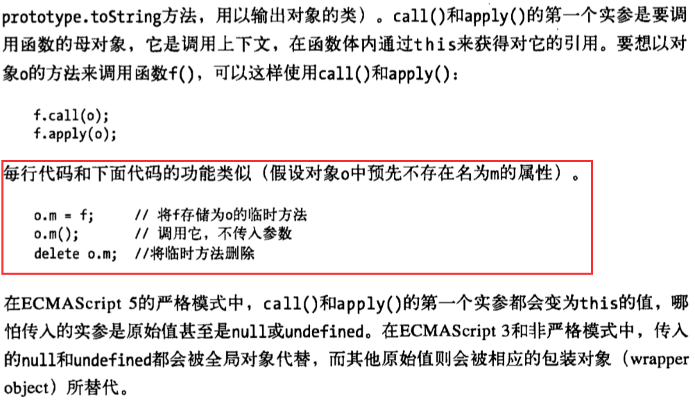

# 深入call、apply、bind实现原理
[https://www.jianshu.com/p/6a1bc149b598](https://www.jianshu.com/p/6a1bc149b598)

简单粗暴地来说，call，apply，bind是用于绑定this指向的。

## 什么是call和apply方法
我们单独看看ECMAScript规范对apply的定义，看个大概就行：                 

通过定义简单说一下call和apply方法，他们就是参数不同，作用基本相同。                      

1、每个函数都包含两个非继承而来的方法：apply()和call()。                     
2、他们的用途相同，都是在特定的作用域中调用函数。                       
3、接收参数方面不同，apply()接收两个参数，一个是函数运行的作用域(this)，另一个是参数数组。                        
4、call()方法第一个参数与apply()方法相同，但传递给函数的参数必须列举出来。                        


一个简单的demo:              
```javascript
let yanle = {
    name: 'yanle',
    sayHello: function (age) {
        console.log(`hello, i am ${this.name} and ${age} years old`);
    }
};
let lele = {
    name: 'lele'
};
yanle.sayHello(26);          // hello, i am yanle and 26 years old

yanle.sayHello.call(lele, 20);          // hello, i am lele and 20 years old
yanle.sayHello.apply(lele, [21]);       // hello, i am lele and 21 years old
```
[请看demo1](./demo1.js)

结果都相同。从写法上我们就能看出二者之间的异同。
相同之处在于，第一个参数都是要绑定的上下文，后面的参数是要传递给调用该方法的函数的。
不同之处在于，call方法传递给调用函数的参数是逐个列出的，而apply则是要写在数组中。

总结一句话介绍call和apply                           
call()方法在使用一个指定的this值和若干个指定的参数值的前提下调用某个函数或方法。                           
apply()方法在使用一个指定的this值和参数值必须是数组类型的前提下调用某个函数或方法  


### 分析call和apply的原理
上面代码，我们注意到了两点：                  
1、call和apply改变了this的指向，指向到lulin                 
2、sayHello函数执行了                 

这里默认大家都对this有一个基本的了解，知道什么时候this该指向谁，
我们结合这两句话来分析这个通用函数：f.apply(o),我们直接看一本书对其中原理的解读，
具体什么书，我也不知道，参数我们先不管，先了解其中的大致原理。

                          

知道了这个基本原来我们再来看看刚才jawil.sayHello.call(lulin, 24)执行的过程：                       
```javascript
// 第一步
lulin.fn = jawil.sayHello
// 第二步
lulin.fn()
// 第三步
delete lulin.fn
```

上面的说的是原理，可能你看的还有点抽象，下面我们用代码模拟实现apply一下。

### 实现aplly方法

#### 模拟实现第一步
根据这个思路，我们可以尝试着去写第一版的 applyOne 函数：
```javascript
Function.prototype.applyOne = function (context) {
    context.fn = this;
    context.fn();
    delete context.fn;
};
let yanle = {
    name: 'yanle',
    sayHello: function (age) {
        console.log(`hello, i am ${this.name} and ${age} years old`);
    }
};
let lele = {
    name: 'lele'
};
yanle.sayHello.applyOne(lele);              // hello, i am lele and undefined years old
```
正好可以打印lulin而不是之前的jawil了。
[请看demo2](./demo2.js)


#### 模拟实现第二步
最一开始也讲了，apply函数还能给定参数执行函数。                  
注意：传入的参数就是一个数组，很简单，我们可以从Arguments对象中取值，
Arguments不知道是何物，赶紧补习，此文也不太适合初学者，第二个参数就是数组对象，
但是执行的时候要把数组数值传递给函数当参数，然后执行，这就需要一点小技巧。

参数问题其实很简单，我们先偷个懒，我们接着要把这个参数数组放到要执行的函数的参数里面去。
```javascript
Function.prototype.applyTwo = function(context) {
    context.fn = this;
    let args = arguments[1];
    context.fn(args.join(','));
    delete context.fn;
}
```
很简单是不是，那你就错了，数组join方法返回的是啥？                 
`typeof [1,2,3,4].join(',')//string`                        
最后是一个 "1,2,3,4" 的字符串，其实就是一个参数，肯定不行啦。

也许有人会想到用ES6的一些奇淫方法，不过apply是ES3的方法，
我们为了模拟实现一个ES3的方法，要用到ES6的方法，反正面试官也没说不准这样。
但是我们这次用eval方法拼成一个函数，类似于这样：
`eval('context.fn(' + args +')')`                   

先简单了解一下eval函数吧
定义和用法:                          
eval() 函数可计算某个字符串，并执行其中的的 JavaScript 代码。                        

语法：`eval(string)`                       
string必需。要计算的字符串，其中含有要计算的 JavaScript 表达式或要执行的语句。
该方法只接受原始字符串作为参数，如果 string 参数不是原始字符串，那么该方法将不作任何改变地返回。
因此请不要为 eval() 函数传递 String 对象来作为参数。

简单来说吧，就是用JavaScript的解析引擎来解析这一堆字符串里面的内容，这么说吧，你可以这么理解，**你把eval看成是<script>标签**。

`eval('function Test(a,b,c,d){console.log(a,b,c,d)};Test(1,2,3,4)')`就是相当于这样：                    
```html
<script>
function Test(a,b,c,d){
    console.log(a,b,c,d)
};
Test(1,2,3,4)
</script>
```

第二版代码大致如下：                  
```javascript
Function.prototype.applyTwo = function(context) {
    var args = arguments[1]; //获取传入的数组参数
    context.fn = this; //假想context对象预先不存在名为fn的属性
    var fnStr = 'context.fn(';
    for (var i = 0; i < args.length; i++) {
        fnStr += i == args.length - 1 ? args[i] : args[i] + ',';
    }
    fnStr += ')';//得到"context.fn(arg1,arg2,arg3...)"这个字符串在，最后用eval执行
    eval(fnStr); //还是eval强大
    delete context.fn; //执行完毕之后删除这个属性
}
//测试一下
var jawil = {
    name: "jawil",
    sayHello: function (age) {
         console.log(this.name,age);
     }
};

var  lulin = {
    name: "lulin",
};

jawil.sayHello.applyTwo(lulin,[24])//lulin 24
```


      


