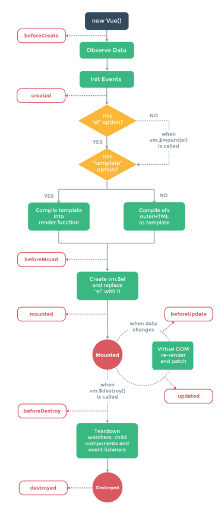

## 基础知识

### <dvi id="class01-11">11、let 和 const 与 var 的区别</div>                        
1、不存在变量提升                                                  
必须先定义后使用，否则报错                               

2、暂时性死区                     
在代码块内，使用let命令声明变量之前，该变量都是不可用的。这在语法上，称为“暂时性死区”（temporal dead zone，简称 TDZ）。

3、不允许重复申明/不允许在函数内部重新申明参数（也算重复申明）                            

4.1 SE5的作用域                     
1）、内层变量覆盖外层的变量                                  
2）、用来计数的循环变量会泄露为全局变量                                        
    
5、const是一个常量，一旦申明，就不能改变。而且在申明的时候必须初始化，不能留到后面赋值。                     

6、在ES5里面，未申明的全局变量会自动生为window的属性:                            
没法在编译过程爆出变量为申明的错误，语法上顶层对象有一个实体含义的对象这样肯定不合适。                             
用var定义的依然会升级为顶层对象(全局对象)window的属性；但是let,const申明则不会                               

### <div id="class01-12">12、事件冒泡以及阻止事件冒泡</div>
```javascript
event.preventDefault();//阻止默认时间
event.stopPropatation();//阻止冒泡
event.stopImmediatePropagation();//处理事件响应优先级
event.currentTarget();//当前绑定的事件
event.target();//获取当前点击元素对象
```

### <div id="class01-13">13、跨域、css3、html5、安全</div>
[可以看这个网站](http://blog.csdn.net/gane_cheng/article/details/52819118)


### <div id="class01-14">14、call和apply的区别</div>
apply：应用某一对象的一个方法，用另一个对象替换当前对象。例如：B.apply(A, arguments);即A对象应用B对象的方法。

apply：最多只能有两个参数——新this对象和一个数组argArray

call：调用一个对象的一个方法，以另一个对象替换当前对象。例如：B.call(A, args1,args2);即A对象调用B对象的方法。

call：它可以接受多个参数，第一个参数与apply一样，后面则是一串参数列表。

call 和 apply 都是为了改变某个函数运行时的 context 即上下文而存在的，换句话说，就是为了改变函数体内部 this 的指向。
二者的作用完全一样，只是接受参数的方式不太一样。


### <div id="class01-15">15、常见的ES6语法</div>
#### 15.01、变量的解构赋值

#### 15.02、字符串的扩展
for...of循环遍历、搜索对应字符串includes()、startsWith()、endsWith()、
arr.repeat(number)、padStart()、padEnd()、arr.padStart(number,'xxxx')、模板字符串;


#### 15.03、数值的扩展
Number.isFinite()、Number.isNaN()、Number.parseInt()、Number.parseFloat()、Number.isInteger()、Math 对象的扩展；

#### 15.04、数组的扩展
**Array.from()、Array.of()**、Array.prototype.copyWithin(target, start = 0, end = this.length)、
数组实例的 **find() 和 findIndex()**、数组实例的 fill()、数组实例的 **entries() ， keys() 和 values()**、
Array.prototype.includes方法返回一个布尔值，表示某个数组是否包含给定的值，与字符串的includes方法类似。

#### 15.05、函数的扩展
函数参数的默认值，函数的 length 属性(将返回没有指定默认值的参数个数)、rest 参数（形式为 “... 变量名 ” ）、**Map 和 Set 结构， Generator 函数、箭头函数**、尾调优化、参数尾逗号；

#### 15.06、对象的扩展
属性的简洁表达方式、方法的 name 属性、Object.is()、Object.assign()、Object.setPrototypeOf()（写操作）、
Object.getPrototypeOf()（读操作）、Object.create()（生成操作）、Object.values()，Object.keys()，Object.entries()；

#### 15.07、Proxy 和 Reflect

#### 15.08、Set 和 Map 数据结构
**Set**: 成员的值都是唯一的，没有重复的值、Set 实例的方法分为两大类：操作方法（用于操作数据）和遍历方法（用于遍历成员）.

操作方法：               
add(value)：添加某个值，返回 Set 结构本身。                   
delete(value)：删除某个值，返回一个布尔值，表示删除是否成功。                       
has(value)：返回一个布尔值，表示该值是否为Set的成员。                   
clear()：清除所有成员，没有返回值。                           

遍历方法：                       
keys()：返回键名的遍历器                     
values()：返回键值的遍历器                   
entries()：返回键值对的遍历器                     
forEach()：使用回调函数遍历每个成员               

           
**WeakSet**: WeakSet 结构与 Set 类似，也是不重复的值的集合。                             
但是，它与 Set 有两个区别。                        
首先， WeakSet 的成员只能是对象，而不能是其他类型的值。                                
其次， WeakSet 中的对象都是弱引用，即垃圾回收机制不考虑 WeakSet 对该对象的引用，
也就是说，如果其他对象都不再引用该对象，那么垃圾回收机制会自动回收该对象所占用的内存，不考虑该对象还存在于 WeakSet 之中。
这个特点意味着，无法引用 WeakSet 的成员，因此 WeakSet 是不可遍历的。

操作方法：               
WeakSet.prototype.add(value) ：向 WeakSet 实例添加一个新成员。              
WeakSet.prototype.delete(value) ：清除 WeakSet 实例的指定成员。                    
WeakSet.prototype.has(value) ：返回一个布尔值，表示某个值是否在 WeakSet 实例之中。                            

**Map**：传统上只能用字符串当作键、它类似于对象，也是键值对的集合，但是 “ 键 ” 的范围不限于字符串，各种类型的值（包括对象）都可以当作键。

#### 15.09、Generator

#### 15.10、Promise 对象
关于promise 的只是点看下面这两个链接                          
[多个promise嵌套实例](../../18年/4月/03、多个promise嵌套实例/README.md)                        
[Promise](../02、ES6&7/12、Promise对象/README.md)

具体相关知识点儿可以看 [《ES6阮一峰》](../02、ES6&7)             


#### 16、react/vue  生命周期


**vue**：                    
beforeCreated、created、beforeMounted、mounted、beforeUpdated、updated、beforeDestroy、destroyed;

**react**:                      
constructor(props){props};组件初始化                 
componentWillMount(){};//组件马上就要加载了                  
render(){};//组件正在加载                 
componentDidMount(){};//组件加载完毕                  
componentWillReceiveProps(){};//组件要接收父组件的信息了                        
shouldComponentUpdate(){return true};//判断组件是不是需要更新组件(一定要返回true)                     
componentWillUpdate(){};//组件马上就要更新组件了                   
componentDidUpdate(){};//组件已经更新数据完毕                 
componentWillUnmount();//组件卸载了                      


