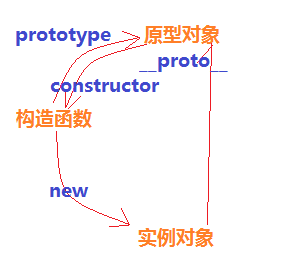

## 基础知识部分

### <div id="class01-01">01、高度已知：左右各300px,中间自适应</div>     

浮动、绝对定位、flexBox（display：flex）、table标签 、网格布局（display:Grid）、display: table-cell;           
延伸：每个解决方案的优缺点，之间的比较；如果去掉高度已知，什么方案不适用了；兼容性，业务中最实用的；              
浮动：需要清除浮动，兼容性比较好；           
绝对定位：快捷、因为已经脱离文档流了，所以子元素都也要脱离文档流，可实用性非常差；           
flex:就是为了以上连个布局的不足的；            
display:table:兼容性非常好，三栏布局，如果某一个高度超出的时候，另外另个也都是会一起增高的；           
网格布局：新技术；           

### <div id="class01-02">02、上下居中方案</div>

### <div id="class01-03">03、css盒模型</div>                 

**标准和模型+IE盒模型：**        
区别：标准模型的宽高是不计算padding和border的，IE是需要计算的      
css如何设置这两种模型：       
默认是： `box-sizing:content-box;box-sizing:border-box;`    
JS如何设置获取盒模型对应的宽高：       

```javascript
dom.style.width/height;     
dom.currentStyle.width/height;      
window.getComputedStyle(dom).width/height;
```      

**解释边距重叠：**         
BFC边距重叠的解决方案        

### <div id="class01-04">04、DOM事件类</div>     
DOM事件级别、DOM事件模型、DOM事件流、DOM事件捕获的具体流程、Event对象的常见应用、自动以事件

**事件级别:**  
DOM0:element.onclick=function(){};
DOM2:elemeng.addEventListener("click",function(){},false);//但三个指定捕获或者冒泡
DOM3:elemeng.addEventListener("keyup",function(){},false);//但三个指定捕获或者冒泡

**事件模型：** 捕获（从上到下）、冒泡（从下到上）；

**事件流：** 用户和浏览器做交互的过程中，事件的传递，比如点击左键，怎么传递到页面上的。
捕获->目标阶段->冒泡

**DOM事件具体流程：**  
window->document->html->body->.....普通html一步一步下传...->目标元素

**Event对象：**  
event.keyCode;  
event.preventDefault();//阻止默认时间     
event.stopPropatation();//阻止冒泡      
event.stopImmediatePropagation();//处理事件响应优先级        
event.currentTarget();//当前绑定的事件     
event.target();//获取当前点击元素对象     

**自定义事件：**
```javascript
    var eve=new Event('custome');
    ev.addEventListener('custome',function(){//ev就是一个简单的元素对象
    console.log('custome');
    });
    ev.dispatchEvent(eve);//触发事件
    
    //需要制定参数的自定义事件    CustomeEvent
    var eve = new CustomeEvent('custome',obj);
```
    
### 5、Http协议类：            
**特点：** 简单快速，灵活、无连接、无状态   
每一个资源对应一个URI，请求只要输入资源地址uri就可以了；     
在每一个http头部协议中都有一个数据类型，通过一个http协议就可以完成不同类型数据的传输；     
链接一次就会断开；       
每一次链接不会记住链接状态的，服务器不区分两次链接的身份；       

**http报文组成部分，建立在TCP之上的:**             
    请求报文：请求行、请求头、空行、请求体     
    请求行：HTTP请求方法、页面地址、协议版本等         
    请求头：key,value值，告诉服务端我要什么内容、要什么数据类型                      
    空行：分割请求头和请求体的，遇到空行，服务器就知道，请求头结束了，接下来是请求体了           
    请求体：就是给服务端的一些入参数据；          
    我所了解的请求体有两种格式，Content-Type: application/x-www-form-urlencoded  和  payload  和 json             

**响应报文：** 状态行、响应头、空行、响应体     
状态行：协议版本  状态码   状态      
其他的一样的      

**响应报文：** 状态行、响应头、空行、响应体
状态行：协议版本  状态码   状态
其他的一样的

**HTTP方法：** GET请求资源、post传输资源、put更新资源、delete删除资源、head获取报文首部           
get和post区别：     
get只能url 编码、post支持多种编码方式            
get在传输参数有长度限制的，而post是没有长度限制的        
get通过url传递，post放在request body中      
get不安全，post是一种安全的传输协议方式     
get会把参数保存到浏览器记录里，而post中的参数不会保存          
get 会被浏览器缓存         

**http状态码：**        
**1.XX**:指示信息-表示请求已经接受，继续处理         
**2.XX:成功**         
    200：请求成功            
    206：客户端发送一个range头的get请求，服务器完成了他         
**3.XX：重定向**        
    301：请求的页面转移到新的url;      
    302:临时转移到新的url          
    304：客户端缓存的文件并发出了一个条件性的请求，服务器告诉客户，原来缓冲的文档还可以继续使用         
**4.XX：客户端错误**             
    400：语法错误        
    401：请求未授权       
    403：请求禁止访问      
    404：请求资源不存在     
**5.XX：服务端错误**     
    500：服务器发生不可预期的错误        
    503：服务器请求未完成        
    
**HTTP持久链接：**                       
http采用的是 "请求-应答" 模式                         
当使用keep-Alive 模式（又称持久链接、链接重用）时、http1.1版本才支持的                        
    Connection: keep-alive                      
            
**管线化：**                                
持久链接下：链接传递消息类似于请求1->响应1->请求2->响应2->请求3->响应3                             
管线化：请求1-》请求2-》请求3-》响应1-》响应2-》响应3                            
需要通过持久链接完成，所以仅HTTP1.1版本支持                       
只有get和head请求支持管线化，post请求是有所限制的          


### <div id="class01-06">原型链</div>
内容：                 
创建对象的几种方式、原型、构造函数、实例、原型链、instanceof原理、new 运算符

#### 创建对象的几种方法
```javascript
// 面向字面量
var o1={name:'01'};
var o11=new Object({name:'o11'});

// 使用显示的构造函数：
var M=function(){this.name='02'};
var o2=new M();

// 通过Object.create()创建
var P={name:'o3'};
var o3=Object.create(P)
```


#### 原型、构造函、实例、原型链：                             

1、基础                  
构造函数可以通过new来生成一个实例、构造函数也是函数；      
              
函数都有一个prototype属性，这个就是原型对象；         
        
原型对象可以通过构造器constructor来指向它的构造函数；             
           
实例的__proto__属性，指向的是其构造函数的原型对象；                          


原型链：从一个实例对象，向上找构造这个实例相关联的对象，相关联的对象又向上找，找到创造它的一个实例对象，
一直到Object.prototype截止。原型链是通过prototype和__proto__向上找的。构造函数通过prototype创建了很多方法，
被其所有实例所公用，存放在原型对象上；                      

例子：
```javascript
var M=function(name){this.name=name};
var o3=new M('o3');
```

当我们需要扩展实例的时候，我们可以对构造函数添加方法，但是这样会创建每一个实例都拷贝一份它自己的添加的方法，
占用内存，而且也没有必要，这个时候就可以新添加的方法写进原型里面去，添加到原型链中去，
在实例的原型链中我们可以在原型对象上找到添加的方法；

```javascript
var M=function(name){this.name=name};
var o3=new M('o3');
M.prototype.say=function(){
Console.log('say hi');
};
var o5=new M('o5');
```
通过这种方式o3和o5都有say方法；原型链的优势是原型对象的方法是被所有实例共有的；

当访问一个实例方法的时候，首先在实例本身找这个方法，如果没有找到就会到其构建函数的原型对象去找，如果还是没有找到，
那么它会继续通过原型链在原型对象的更上一级查找，一直到object.prototype;

一定要记住只有函数才有proptotype,对象是没有的；

只有实例对象又__proto__ , 因为函数也是对象，所以函数也有__proto__ , 但是和实例对象的__proto__是有区别的，函数的__proto__是function这个对象的构造实例；


2、instanceof原理

实例对象上面有一个__proto__ ，这个是引用的它构造函数的原型对象；

instanceof是用来判断实例是不是由某个构造函数实例化出来的对象，其原理是判断实例对象是否指向构造函数的原型；
只要是在原型链上的函数，都会被instanceof看做是实例对象的一个构造函数，所以都会返回true;


