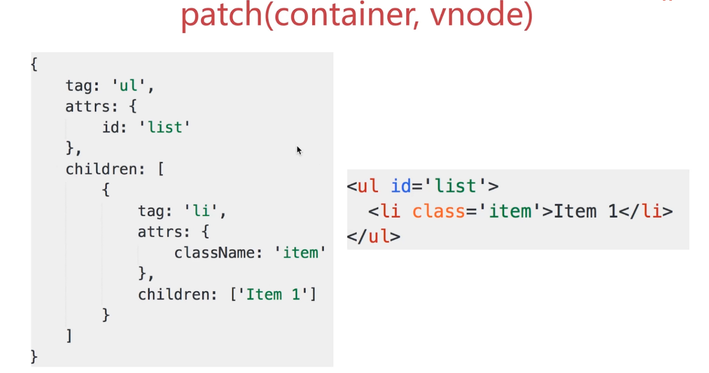
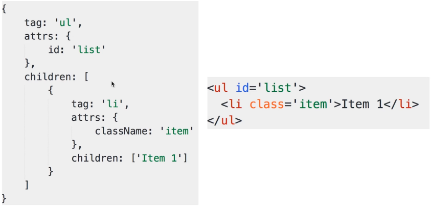
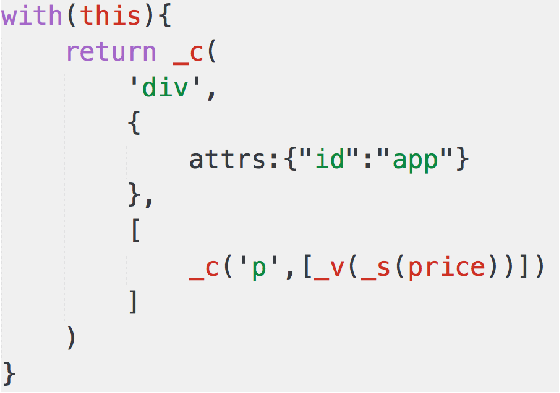
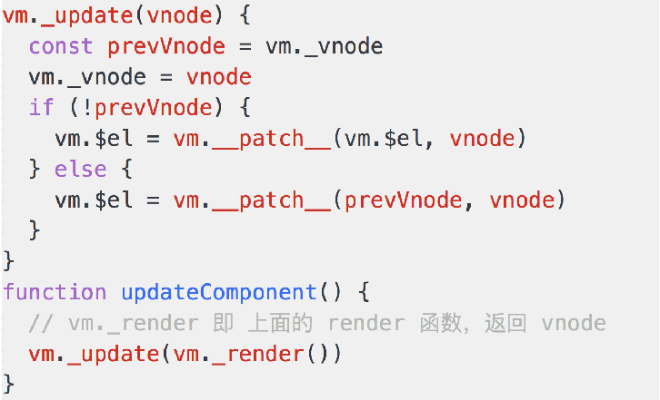

## 进阶知识部分

目录
- [11、虚拟dom-virtual DOM](#class02-11)


### <div id="class02-11">11、虚拟dom-virtual DOM</div>

### 11.1、vdom 概念
用JS模拟DOM结构。             
DOM变化的对比，放在JS层来做。               
提升重绘性能。

比如有abc 三个dom， 如果我们要删除b dom, 以前浏览器的做法是 全部删除abc dom ， 然后 在添加b dom 。这样做的成本会非常高。       

### 11.2、用JS模拟 dom 
例如下面的一个dom 结构：
```html
<ul id="list">
    <li class="item">item1</li>
    <li class="item">item2</li>
</ul>
```

这样的dom 结构，可以模拟为下面的JS :
```javascript
let dom = {
    tag: 'ul',
    attrs: {
        id: 'list'
    },
    children: [
        {
            tag: 'li',
            attrs: {className: 'item'},
            children: ['item1']
        },
        {
            tag: 'li',
            attrs: {className: 'item'},
            children: ['item2']
        }
    ]
}
```
浏览器操作dom 是花销非常大的。执行JS花销要小非常多，所以这就是为什么虚拟dom 出现的一个根本原因。

### 11.3、jquery实现virtual-dom
#### 一个需求场景
1、数据生成表格。 2、随便修改一个信息，表格也会跟着修改。
```html
<body>
<div id="container"></div>
<br>
<button id="btn-change">change</button>
<script>
    let data = [
        {
            name: 'yanle',
            age: '20',
            address: '重庆'
        },
        {
            name: 'yanle2',
            age: '25',
            address: '成都'
        },
        {
            name: 'yanle3',
            age: '27',
            address: '深圳'
        }
    ];

    // 渲染函数
    function render(data) {
        let $container = document.getElementById('container');
        $container.innerHTML = '';

        let $table = document.createElement('table');
        $table.setAttribute('border', true);
        $table.insertAdjacentHTML('beforeEnd', `<tr>
                                    <td>name</td>
                                    <td>age</td>
                                    <td>address</td>
                                    </tr>`);

        data.forEach(function (item) {
            $table.insertAdjacentHTML('beforeEnd',
                `<tr>
                    <td>${item.name}</td>
                    <td>${item.age}</td>
                    <td>${item.address}</td>
                </tr>`
            )
        });

        $container.appendChild($table);
    }

    // 修改信息
    let button = document.getElementById('btn-change');
    button.addEventListener('click', function () {
        data[1].name = '徐老毕';
        data[1].age = 30;
        data[1].address  = '深圳';
        render(data);
    });
    render(data);
</script>
</body>
```
实际上上面的这段代码也是不符合预期的，因为每次使用render 方法，都会全部渲染整个table, 但是并未没有只渲染我们想要的第二行。

**遇到的问题**：                  
DOM 操作是非常 "昂贵" 的， JS 运行效率高。虚拟dom 的核心就是diff算法，对比出不同的dom数据，定点渲染不同的数据。

### 11.4、virtual-dom 实现之一: snabbdom
vue2.0就是使用的snabbdom                 
一个简单的使用实例：                  
```javascript
var snabbdom = require('snabbdom');
var patch = snabbdom.init([ // Init patch function with chosen modules
  require('snabbdom/modules/class').default, // makes it easy to toggle classes
  require('snabbdom/modules/props').default, // for setting properties on DOM elements
  require('snabbdom/modules/style').default, // handles styling on elements with support for animations
  require('snabbdom/modules/eventlisteners').default, // attaches event listeners
]);
var h = require('snabbdom/h').default; // helper function for creating vnodes

var container = document.getElementById('container');

var vnode = h('div#container.two.classes', {on: {click: someFn}}, [
  h('span', {style: {fontWeight: 'bold'}}, 'This is bold'),
  ' and this is just normal text',
  h('a', {props: {href: '/foo'}}, 'I\'ll take you places!')
]);
// Patch into empty DOM element – this modifies the DOM as a side effect
patch(container, vnode);

var newVnode = h('div#container.two.classes', {on: {click: anotherEventHandler}}, [
  h('span', {style: {fontWeight: 'normal', fontStyle: 'italic'}}, 'This is now italic type'),
  ' and this is still just normal text',
  h('a', {props: {href: '/bar'}}, 'I\'ll take you places!')
]);
// Second `patch` invocation
patch(vnode, newVnode); // Snabbdom efficiently updates the old view to the new state
```


#### snabbdom 核心api
- snabbdom.init: 
The core exposes only one single function snabbdom.init. This init takes a list of modules and returns a patch function that uses the specified set of modules.                         
```javascript
var patch = snabbdom.init([
  require('snabbdom/modules/class').default,
  require('snabbdom/modules/style').default,
]);
```

- patch:
```javascript
patch(oldVnode, newVnode);
```

- snabbdom/h:
It is recommended that you use snabbdom/h to create vnodes. h accepts a tag/selector as a string, an optional data object and an optional string or array of children.                      
```javascript
var h = require('snabbdom/h').default;
var vnode = h('div', {style: {color: '#000'}}, [
  h('h1', 'Headline'),
  h('p', 'A paragraph'),
]);
```

- snabbdom/tovnode:
Converts a DOM node into a virtual node. Especially good for patching over an pre-existing, server-side generated content.                  
```javascript
var snabbdom = require('snabbdom')
var patch = snabbdom.init([ // Init patch function with chosen modules
  require('snabbdom/modules/class').default, // makes it easy to toggle classes
  require('snabbdom/modules/props').default, // for setting properties on DOM elements
  require('snabbdom/modules/style').default, // handles styling on elements with support for animations
  require('snabbdom/modules/eventlisteners').default, // attaches event listeners
]);
var h = require('snabbdom/h').default; // helper function for creating vnodes
var toVNode = require('snabbdom/tovnode').default;

var newVNode = h('div', {style: {color: '#000'}}, [
  h('h1', 'Headline'),
  h('p', 'A paragraph'),
]);

patch(toVNode(document.querySelector('.container')), newVNode)
```

#### h函数 和 patch 的使用
例如下面的一个dom 结构：
```html
<ul id="list">
    <li class="item">item1</li>
    <li class="item">item2</li>
</ul>
```
用h函数来表示，就如下形式：
```javascript
let vnode = h('ul#list', {}, [
    h('li.item', {}, 'item1'),
    h('li.item', {}, 'item2')
])
```
作用就是模拟的一个真实节点。                      

patch的使用方式：                 
第一种方式 patch('容器', vnode);  // 这种使用方式是直接渲染dom                            
第二种是用方式: patch(oldVnode, newVnode);         // 这种方式会自动对比dom的差异性，然后只渲染我们需要dom;

一个简单的使用实例：
```html
<!DOCTYPE html>
<html lang="en">
<head>
    <meta charset="UTF-8">
    <title>snabbdom</title>
    <script src="https://cdn.bootcss.com/snabbdom/0.7.1/snabbdom.js"></script>
    <script src="https://cdn.bootcss.com/snabbdom/0.7.1/snabbdom-class.js"></script>
    <script src="https://cdn.bootcss.com/snabbdom/0.7.1/snabbdom-props.js"></script>
    <script src="https://cdn.bootcss.com/snabbdom/0.7.1/snabbdom-style.js"></script>
    <script src="https://cdn.bootcss.com/snabbdom/0.7.1/snabbdom-eventlisteners.js"></script>
    <script src="https://cdn.bootcss.com/snabbdom/0.7.1/h.js"></script>
</head>
<body>
<div id="container"></div><br>

<button id="btn-change">change</button>


<script>
    let snabbdom = window.snabbdom;
    let container = document.getElementById('container');
    let buttonChange = document.getElementById('btn-change');

    // 定义patch
    let patch = snabbdom.init([
        snabbdom_class,
        snabbdom_props,
        snabbdom_style,
        snabbdom_eventlisteners
    ]);

    // 定义h
    let h = snabbdom.h;

    // 生成vnode
    let vnode = h('ul#list', {}, [
        h('li.item', {}, 'item1'),
        h('li.item', {}, 'item2')
    ]);
    patch(container, vnode);

    // 模拟一个修改的情况
    buttonChange.addEventListener('click', function () {
        let newVnode = h('ul#list', {}, [
            h('li.item', {}, 'item1'),
            h('li.item', {}, 'item B'),
            h('li.item', {}, 'item 3')
        ]);
        patch(vnode, newVnode);
    })
</script>
</body>
</html>
```

#### snabbdom 的使用实例
```html
<body>
<div id="container"></div>
<br>
<button id="btn-change">change</button>
<script>
    let snabbdom = window.snabbdom;
    let container = document.getElementById('container');
    let buttonChange = document.getElementById('btn-change');

    // 定义patch
    let patch = snabbdom.init([
        snabbdom_class,
        snabbdom_props,
        snabbdom_style,
        snabbdom_eventlisteners
    ]);

    // 定义h
    let h = snabbdom.h;
    let data = [
        {
            name: 'yanle',
            age: '20',
            address: '重庆'
        },
        {
            name: 'yanle2',
            age: '25',
            address: '成都'
        },
        {
            name: 'yanle3',
            age: '27',
            address: '深圳'
        }
    ];

    data.unshift({
        name: '姓名',
        age: '年龄',
        address: '地址'
    });

    let vnode;
    function render(data) {
        let newVnode = h('table', {style: {'font-size': '16px'}}, data.map(function (item) {
            let tds = [];
            let i ;
            for (i in item) {
                if(item.hasOwnProperty(i)) {
                    tds.push(h('td', {},   h('a', {props: {href: '/foo'}}, item[i])))
                }
            }
            return h('tr', {}, tds)
        }));

        if(vnode) {
            patch(vnode, newVnode);
        } else {
            patch(container, newVnode);
        }

        vnode = newVnode;
    }

    // 初次渲染
    render(data);
    buttonChange.addEventListener('click', function () {
        data[1].age=30;
        data[1].address = '非洲';
        render(data);
    });
</script>
</body>
```


### 11.5、diff算法
#### 概念
就是找出两个文件的不同                     

diff 算法是非常复杂的，实现难度非常大， 源码两非常大。 所以需要去繁就简，明白流程，不关心细节。                 
在vdom中，需要找出本次dom 必须更新的节点来更新，其他的不用更新。找出这个过程就是diff算法实现的。找出前后两个虚拟dom的差异。


#### diff实现的过程
这里以snabbdom为例子：                 
patch(container, vnode); patch(vnode, newVnode); 这两个方法里面就使用到了diff算法。 用patch方法来解析diff算法流程核心。                                            

**patch(container, vnode)**                             
                                       

如果上面的数据， 我们怎么构建真正的dom 结构：
```javascript
let createElement = function(vnode) {
    let tag = vnode.tag;
    let attrs = vnode.attrs || {};
    let children = vnode.children || {};
    
    if(!tag) return null;
    
    // 创建元素
    let elem = document.createElement(tag);
    
    // 属性
    let attrName;
    for (attrName in attrs) {
        if(attrs.hasOwnProperty(attrName)) {
            elem.setAttribute(attrName, attrs[attrName])
        }
    }
    
    // 子元素
    children.forEach(function (childVnode) {
        // 给 elem 添加元素
        elem.appendChild(createElement(childVnode))
    });
    
    return elem;
};
```

**patch(vnode, newVnode)**                      
                          
                      

伪代码实现如下
```javascript
let createElement = function(vnode) {
    let tag = vnode.tag;
    let attrs = vnode.attrs || {};
    let children = vnode.children || {};

    if(!tag) return null;

    // 创建元素
    let elem = document.createElement(tag);

    // 属性
    let attrName;
    for (attrName in attrs) {
        if(attrs.hasOwnProperty(attrName)) {
            elem.setAttribute(attrName, attrs[attrName])
        }
    }

    // 子元素
    children.forEach(function (childVnode) {
        // 给 elem 添加元素
        elem.appendChild(createElement(childVnode))
    });

    return elem;
};
```

#### diff算法的其他内容
- 节点的新增和删除
- 节点重新排序
- 节点属性、样式、事件绑定
- 如果极致压榨性能


### <div id="class02-12">12、深入mvvm</div>

#### 12.1、使用jquery和其他框架的区别

#### 12.1.1、原生JS实现一个todo-list
```html
<body>
<div>
    <input type="text" name="" id="txt-title"> <br>
    <button id="btn-submit">submit</button>
</div>
<div>
    <ul id="ul-list"></ul>
</div>
<script>
    let $txtTitle = document.getElementById('txt-title');
    let $buttonSubmit = document.getElementById('btn-submit');
    let $ulList = document.getElementById('ul-list');
    $buttonSubmit.addEventListener('click', function () {
        let title = $txtTitle.value;
        if(!title) return false;

        let $li = document.createElement('li');
        $li.innerText = title;

        $ulList.appendChild($li);
        $txtTitle.value = '';
    })
</script>
</body>
```


#### 12.1.2、vue实现todo-list
```html
<body>
<div id="app">
    <div>
        <input v-model="title"> <br>
        <button id="btn-submit" v-on:click="add">submit</button>
    </div>
    <div>
        <ul id="ul-list">
            <li v-for="item in list">{{item}}</li>
        </ul>
    </div>
</div>
<script>
    let vm = new window.Vue({
        el: '#app',
        data: {
            title: '',
            list: []
        },
        methods: {
            add: function () {
                this.list.push(this.title);
                this.title = '';
            }
        }
    })
</script>
</body>
```

#### 12.1.3、两者之间的区别
- 数据和视图分离(开放封闭原则： 扩展开放，修改封闭)
- 数据驱动视图
 

#### 12.2.1、对mvvm的理解
具体的理解自己再去整理

MVVM框架的三大要素：                                                                        
响应式、模板引擎、渲染


#### 12.2.2、响应式的实现
修改data属性之后，立马就能监听到。                 
data属性挂在到vm实例上面。

有下面的一个问题，我们是如何监听属性的获取和属性的赋值的。
```javascript
let obj = {
    name: 'yanle',
    age: 25
};
console.log(obj.name);
obj.age = 26;
```

是通过**Object.defineProperty** 实现的, 下面的代码就可以实现一个完整的属性修改和获取的监听。
```javascript
let vm = {};
let data = {
    name: 'yanle',
    age: 25
};
let key, value;
for (key in data) {
    (function (key) {
        Object.defineProperty(vm, key, {
            get: function () {
                console.log('get', data[key]);
                return data[key];           // data的属性代理到vm 上 
            },
            set: function (newValue) {
                console.log('set', newValue);
                data[key] = newValue;
            }
        })
    })(key)
}
```

#### 12.2.3、vue中的模板

**模板**                              
本质就是字符串；                        
有逻辑： if for 等；                  
跟html格式很像， 但是区别很大;                              
最终要转为HTML来现实；                               
模板需要用JS代码来实现， 因为有逻辑，只能用JS来实现；                       


**render函数-with用法**：                                         
```javascript
let obj = {
    name: 'yanle',
    age: 20,
    getAddress: function () {
        alert('重庆')
    }
};
// 不用with 的情况
// function fn() {
//     alert(obj.name);
//     alert(obj.age);
//     obj.getAddress();
// }
// fn();

// 使用with的情况
function fn1() {
    with (obj) {
        alert(name);
        alert(age);
        getAddress();
    }
}
fn1();
```
这种with 的使用方法就如上所述。但是尽量不要用，因为《JavaScript语言精粹》中，作者说过，这种使用方式会给代码的调试带来非常大的困难。                               
但是vue源码中的render 就是用的这个;


**render函数**:                                   
                               
                           

模板中的所有信息都包含在了render 函数中。                        
一个特别简单的示例:                      
```javascript
let vm = new Vue({
        el: '#app',
        data: {
            price: 200
        }
    });

    // 一下是手写的
    function render() {
        with (this) {               // 就是vm
            _c(
                'div',
                {
                    attr: {'id': 'app'}
                },
                [
                    _c('p', [_v(_s(price))])
                ]
            )
        }
    }

    function render1() {
        return vm._c(
            'div',
            {
                attr: {'id': 'app'}
            },
            [
                _c('p', [vm._v(vm._s(vm.price))])       // vm._v 是创建文本， _s 就是toString
            ]
        )
    }
```

如果我们用一个复杂的例子来描述这个东西。在源码中， 搜索code.render, 然后在在此之前打印render 函数，就可以看看这个到底是什么东西了。
```javascript
var createCompiler = createCompilerCreator(function baseCompile (
    template,
    options
) {
    var ast = parse(template.trim(), options);
    if (options.optimize !== false) {
        optimize(ast, options);
    }
    var code = generate(ast, options);
    console.log(code.render);
    return {
        ast: ast,
        render: code.render,
        staticRenderFns: code.staticRenderFns
    }
});
```
然后运行， 就可以看到到底render 函数是什么东西了。 就可以截取源码出来看了。                  
相对应的模板如下:                               
```html
<div id="app">
    <div>
        <input v-model="title"> <br>
        <button id="btn-submit" v-on:click="add">submit</button>
    </div>
    <div>
        <ul id="ul-list">
            <li v-for="item in list">{{item}}</li>
        </ul>
    </div>
</div>
```
截取的render函数如下：
```javascript
function codeRender() {
    with (this) {
        return _c('div',
            {attrs: {"id": "app"}},
            [
                _c('div', [
                    _c('input', {
                        directives: [{
                            name: "model",
                            rawName: "v-model",
                            value: (title),             // 渲染 指定数据
                            expression: "title"
                        }],
                        domProps: {"value": (title)},   // 渲染 指定数据
                        on: {                       // 通过input输入事件， 修改title
                            "input": function ($event) {
                                if ($event.target.composing) return;
                                title = $event.target.value
                            }
                        }
                    }),
                    _v(" "),                // 文本节点
                    _c('br'),
                    _v(" "),
                    _c('button', {          // dom 节点
                            attrs: {"id": "btn-submit"},
                            on: {"click": add}              // methods 里面的东西也都挂在this上面去了
                        },
                        [_v("submit")])]),

                _v(" "),

                _c('div', [
                    _c('ul',
                        {attrs: {"id": "ul-list"}},
                        _l((list), function (item) {                // 数组节点
                            return _c('li', [_v(_s(item))])
                        })
                    )
                ])
            ])
    }
}
```
从vue2.0开始支持预编译， 我们在开发环境下，写模板， 编译打包之后， 模板就变成了JS代码了。vue已经有工具支持这个过程。                       
 
 
#### 12.2.4、vue中的渲染
vue的渲染是直接渲染为虚拟dom ,这一块儿的内容，其实是借鉴的snabbdom, 非常相似，可以去看看snabbdom 就可以一目了然了。                         
vue中的具体渲染实现:                        



#### 12.3、整体流程的实现
第一步： 解析模板形成render 函数                            
- with 用法
- 模板中的所有数据都被render 函数包含
- 模板中data的属性，变成了JS变量
- 模板中的v-model、v-for、v-on都变成了JS的逻辑
- render函数返回vnode

第二步： 响应式开始监听数据变化                                    
- Object.defineProperty 的使用
- 讲data中的属性代理到vm 上

第三步： 首次渲染，显示页面，而且绑定数据和依赖                                
- 初次渲染， 执行updateComponent, 执行vm._render();                              
- 执行render函数， 会访问到vm.list和vm.title等已经绑定好了的数据；                               
- 会被详情是的get 方法监听到                           
    为何一定要监听get, 直接监听set 不行吗？ data中有很多的属性，有的被用到了，有的没有被用到。被用到的会走get, 不被用到的不会走get。
    没有被get监听的属性，set的时候也不会被坚挺。为的就是减少不必要的重复渲染，节省性能。                       
- 执行updateComponent的时候，会执行vdom的patch方法                          
- patch 讲vnode渲染为DOM， 初次渲染完成                            

第四步： data属性变化，出发render                              
- 修改属性值， 会被响应式的set监听到                       
- set中会执行updateComponent， 重新执行vm.render()                       
- 生成vnode和prevVnode, 通过patch进行对比                            
- 渲染到html中                              


### <div id="class02-13">13、深入react理解</div>
这一部分的内容，用create-react-app 脚手架工具来演示项目；                               

组件化的理解： 组件的封装、组件的复用                                 

封装： 视图、数据、逻辑（数据驱动视图）                                        
复用： props传值


#### 13.1、JSX的本质                        
JSX 语法根本无法被浏览器所解析
那么它如何在浏览器运行      

**JSX 解析**：                 
我们import 的react 实际上是在 jsx 转为 JS 代码的时候使用到的。                      
                         


### <div id="class02-14">14、深入Redux架构</div>
[深入Redux架构](../../book/01、react专题/04、深入Redux架构.md)


