# 学习javascript数据结构与算法

## 学习javascript数据结构与算法 [巴西] Loiane Groner 著 孙晓博等译

目录结构
- [01章、javascript基础](#class01)
    - [1.5、面向对象编程](#class01-05)
- [03章、栈](#class03)
    - [3.1、栈的创建](#class03-01)
    - [3.2、从十进制到二进制](#class03-02)
- [04章、队列](#class04)
    - [4.1、创建队列](#class04-01)
    - [4.2、优先队列](#class04-02)


## <div id='class01'>01章、javascript基础</div>              
### <div id='class01-05'>1.5、面向对象编程</div>
一般来说创建对象有三种方式                        
方式1：            
```javascript
//方式1
let obj = new Object({});
```

方式2:                
```javascript
//方式2
let obj = {};
obj = {
    name: {
        first: 'Gandalf',
        last: 'the Grey'
    },
    address: 'Middle Earth'
};
```

方式3：                
```javascript
//方式3
function Book(title,pages, isbn) {
    this.title = title;
    this.pages = pages;
    this.isbn = isbn;
}
let book =new Book('title', 'page', 'isbn');
console.log(book.title); //输出书名
book.title = 'new title'; //修改书名
console.log(book.title); //输出新的书名
//使用原型扩展
Book.prototype.printTitle = function() {
    console.log(this.title)
};
console.log(book);
console.log(book.__proto__);
```

## <div id='class03'>03章、栈</div>
### <div id='class03-01'>3.1、栈的创建</div>
```javascript
/**
   push(element(s)) ：添加一个（或几个）新元素到栈顶。
   pop() ：移除栈顶的元素，同时返回被移除的元素。
   peek() ：返回栈顶的元素，不对栈做任何修改（这个方法不会移除栈顶的元素，仅仅返回它）。
   isEmpty() ：如果栈里没有任何元素就返回 true ，否则返回 false 。
   clear() ：移除栈里的所有元素。
   size() ：返回栈里的元素个数。这个方法和数组的 length 属性很类似。
 * @constructor
 */
let Stack = function() {
    let items = [];
    this.push = function (element) {
        items.push(element)
    };
    this.pop = function () {
        return items.pop();
    };
    this.peek = function () {
        return items[items.length - 1]
    };
    this.isEmpty = function() {
        return items.length === 0
    };
    this.clear = function() {
        items = [];
    };
    this.print = function() {
        console.log(items.toString());
    };
    this.size = function() {
        return items.length;
    }
};
```
[可以去看如下的示例代码](./03章、栈/01、栈的创建/index.js)
[堆栈的一个简单使用](./03章、栈/01、栈的创建/test.js)


### <div id='class03-02'>3.2、从十进制到二进制</div>
我们在十进制转为2进制的时候，就需要使用到上面的堆栈对象来实现，我们可以吧堆栈直接方封装为一个模块，然后通过module.exports = Stack这种方式抛出                    
```javascript
let Stack = require('../01、栈的创建/index');
//十进制转换为2进制
function divideBy2(decNumber) {
    let remStack = new Stack(), rem, binaryString = '';
    while (decNumber > 0) {
        rem = Math.floor(decNumber % 2);
        remStack.push(rem);
        decNumber = Math.floor(decNumber / 2);
    }
    while (!remStack.isEmpty()) {
        binaryString += remStack.pop().toString()
    }
    return binaryString;
}
```

还可以创建另外的一个方法，让我们的十进制可以转为其他进制数               
```javascript
//十进制转为其他进制
function baseConverter(decNumber, base) {
    let remStack = new Stack(), rem, baseString = '', digits = '0123456789ABCDEF';
    while (decNumber > 0) {
        rem = Math.floor(decNumber % base);
        remStack.push(rem);
        decNumber = Math.floor(decNumber / base)
    }
    while (!remStack.isEmpty()) {
        baseString += digits[remStack.pop()];
    }
    return baseString;
}
console.log(baseConverter(100345, 2)); //输出11000011111111001
console.log(baseConverter(100345, 8)); //输出303771
console.log(baseConverter(100345, 16)); //输出187F9
```


## <div id='class04'>04章、队列</div>                       
### <div id='class04-01'>4.1、创建队列</div>                           
```javascript
/**
   enqueue(element(s)) ：向队列尾部添加一个（或多个）新的项。
   dequeue() ：移除队列的第一（即排在队列最前面的）项，并返回被移除的元素。
   front() ：返回队列中第一个元素——最先被添加，也将是最先被移除的元素。队列不做任何变动（不移除元素，只返回元素信息——与 Stack 类的 peek 方法非常类似）。
   isEmpty() ：如果队列中不包含任何元素，返回 true ，否则返回 false 。
   size() ：返回队列包含的元素个数，与数组的 length 属性类似。
 * @constructor
 */
function Queue() {
    let items = [];
    this.enqueue = function(element) {
        items.push(element)
    };
    this.dequeue = function() {
        return items.shift()
    };
    this.front = function() {
        return items[0]
    };
    this.isEmpty = function() {
        return items.length === 0
    };
    this.clear = function() {
        items = [];
    };
    this.size = function() {
        return items.length
    };
    this.print = function() {
        console.log(items.toString())
    }
}
module.exports = Queue;
```
### <div id='class04-02'>4.2、优先队列</div>
实现一个优先队列，有两种选项：设置优先级，然后在正确的位置添加元素；或者用入列操作添加元素，然后按照优先级移除它们。在这个示例中，我们将会在正确的位置添加元素，因此可以对它们使用默认的出列操作                                    
```javascript
function PriorityQueue() {
    let items = [];

    function QueueElement(element, priority) { // {1}
        this.element = element;
        this.priority = priority;
    }

    this.enqueue = function (element, priority) {
        let queueElement = new QueueElement(element, priority);
        if (this.isEmpty()) {
            items.push(queueElement); // {2}
        } else {
            let added = false;
            for (let i = 0; i < items.length; i++) {
                if (queueElement.priority <
                    items[i].priority) {
                    items.splice(i, 0, queueElement); // {3}
                    added = true;
                    break; // {4}
                }
            }
            if (!added) { //{5}
                items.push(queueElement);
            }
        }
    };

    this.enqueue = function(element) {
        items.push(element)
    };

    this.dequeue = function() {
        return items.shift()
    };

    this.front = function() {
        return items[0]
    };

    this.isEmpty = function() {
        return items.length === 0
    };

    this.clear = function() {
        items = [];
    };

    this.size = function() {
        return items.length
    };

    this.print = function() {
        console.log(items.toString())
    }
}

module.exports = PriorityQueue
```

测试示例：           
```javascript
let PriorityQueue = require('./index');

let priorityQueue = new PriorityQueue();
priorityQueue.enqueue("John", 2);
priorityQueue.enqueue("Jack", 1);
priorityQueue.enqueue("Camila", 1);
priorityQueue.print();
```

[示例请见](./04章、队列/02、优先队列/index.js)

### <div id='class04-03'>4.3、循环队列</div>
还有另一个修改版的队列实现，就是循环队列。循环队列的一个例子就是击鼓传花游戏（HotPotato）。在这个游戏中，孩子们围成一个圆圈，把花尽快地传递给旁边的人。某一时刻传花停止，这个时候花在谁手里，谁就退出圆圈结束游戏。重复这个过程，直到只剩一个孩子（胜者）。                            
[在下面这个示例中，我们要实现一个模拟的击鼓传花游戏](./04章、队列/03、循环队列-击鼓传花/index.js)                     


## <div id='class05'>05章、链表</div>                         
要存储多个元素，数组（或列表）可能是最常用的数据结构。正如本书之前提到过的，每种
语言都实现了数组。这种数据结构非常方便，提供了一个便利的 [] 语法来访问它的元素。然而，
这种数据结构有一个缺点：（在大多数语言中）数组的大小是固定的，从数组的起点或中间插入
或移除项的成本很高，因为需要移动元素（尽管我们已经学过的JavaScript的 Array 类方法可以帮
我们做这些事，但背后的情况同样是这样）。

### <div id='class05-01'>5.1、创建一个链表</div>                   
以下是我们的 LinkedList类的骨架：              
```javascript
function LinkedList() {
var Node = function(element){ // {1}
this.element = element;
this.next = null;
};
var length = 0; // {2}
var head = null; // {3}
this.append = function(element){};
this.insert = function(position, element){};
this.removeAt = function(position){};
this.remove = function(element){};
this.indexOf = function(element){};
this.isEmpty = function() {};
this.size = function() {};
this.toString = function(){};
this.print = function(){};
}
```

具体实现如下：[请见1、创建一个链表](./05章、链表/01、创建一个链表/index.js)


### <div id='class05-02'>5.2、双向链表</div>
链表有多种不同的类型，这一节介绍双向链表。双向链表和普通链表的区别在于，在链表中，
一个节点只有链向下一个节点的链接，而在双向链表中，链接是双向的：一个链向下一个元素，
另一个链向前一个元素

略。。。。。。。。。。


## <div id='class06'>06章、集合</div>
迄今为止，我们已经学习了数组（列表）、栈、队列和链表（及其变种）等顺序数据结构。在这一章中，我们要学习集合这种数据结构。            
集合是由一组无序且唯一（即不能重复）的项组成的。这个数据结构使用了与有限集合相同的数学概念，但应用在计算机科学的数据结构中。              
在深入学习集合的计算机科学实现之前，我们先看看它的数学概念。在数学中，集合是一组不同的对象（的集）。              
比如说，一个由大于或等于0的整数组成的自然数集合：N = {0, 1, 2, 3, 4, 5, 6, …}。集合中的对象列表用“{}”（大括号）包围。                 

还有一个概念叫空集。空集就是不包含任何元素的集合。比如24和29之间的素数集合。由于24和29之间没有素数（除了1和自身，没有其他正因数的大于1的自然数），这个集合就是空集。空集用“{ }”表示。              

你也可以把集合想象成一个既没有重复元素，也没有顺序概念的数组。                 

在数学中，集合也有并集、交集、差集等基本操作。在这一章中我们也会介绍这些操作。                       

### <div id='class06-01'>6.1、创建一个集合</div>
目前的JavaScript实现是基于2011年6月发布的ECMAScript 5.1（现代浏览器均已支持），它包
括了我们在之前章节已经提到过的 Array 类的实现。ECMAScript 6（官方名称ECMAScript 2015，
2015年6月发布）包括了 Set 类的实现。

在这一章中，我们要实现的类就是以ECMAScript 6中 Set 类的实现为基础的。   
  add(value) ：向集合添加一个新的项。          
  remove(value) ：从集合移除一个值。             
  has(value) ：如果值在集合中，返回 true ，否则返回 false 。                
  clear() ：移除集合中的所有项。              
  size() ：返回集合所包含元素的数量。与数组的 length 属性类似。               
  values() ：返回一个包含集合中所有值的数组。                         

```javascript
class Set{
    constructor() {
        this.items = {};
    }

    has(value) {
        return this.items.hasOwnProperty(value);
    }

    add(value) {
        if(!this.has(value)) {
            this.items[value] = value;
            return true;
        }
        return false;
    }

    remove(value) {
        if(this.has(value)) {
            delete this.items[value];
            return true;
        }
        return false;
    }

    clear() {
        this.items = {};
    }

    size() {
        return Object.keys(this.items).length;
    }

    values() {
        return Object.keys(this.items);
    }
}

module.exports = Set;
```
完整示例请见：[01、创建一个集合](./06章、集合/01、创建一个集合/)


### <div id='class06-02'>6.2、集合操作</div>
对集合可以进行如下操作。                
  并集：对于给定的两个集合，返回一个包含两个集合中所有元素的新集合。            
  交集：对于给定的两个集合，返回一个包含两个集合中共有元素的新集合。                
  差集：对于给定的两个集合，返回一个包含所有存在于第一个集合且不存在于第二个集合的元素的新集合。                  
  子集：验证一个给定集合是否是另一集合的子集。               

**6.2.1、并集**                                   
并集的数学概念，集合A和B的并集，表示为A∪B，定义如下：           
`A∪B = { x | x ∈ A∨x ∈ B }`                            
意思是x（元素）存在于A中，或x存在于B中。          

现在来实现 Set 类的 union 方法：          
```javascript
union(otherSet) {
    let unionSet = new Set();
    let values = this.values();

    for (let i = 0; i < values.length; i++) {
        unionSet.add(values[i]);
    }

    values = otherSet.values();
    for (let i = 0; i < values.length; i++) {
        unionSet.add(values[i]);
    }

    return unionSet;
}
```

**6.2.2、交集**            
交集的数学概念，集合A和B的交集，表示为A∩B，定义如下：               
A∩B = { x | x ∈ A∧x ∈ B }                   
意思是x（元素）存在于A中，且x存在于B中。              

具体实现：   
```javascript
// 交集
intersection(otherSet) {
    let intersectionSet = new Set();
    let values = this.values();

    for(let i = 0; i < values.length; i++) {
        if(otherSet.has(values[i])) {
            intersectionSet.add(values[i]);
        }
    }
    return intersectionSet;
}
```


**6.2.3、差集**                
差集的数学概念，集合A和B的差集，表示为A - B，定义如下：             
`A-B = { x | x ∈ A ∧ x   B }`              
意思是x（元素）存在于A中，且x不存在于B中。                 

现在来实现 Set 类的 difference 方法：             
```javascript
difference(otherSet) {
    let difference = new Set();
    let values = this.values();

    for(let i = 0;i < values.length; i++) {
        if(!otherSet.has(values[i])) {
            difference.add(values[i]);
        }
    }
    return difference;
}
```

**6.2.4、子集**                                 
我们要介绍的最后一个集合操作是子集。子集的数学概念，集合A是B的子集（或集合B包含了A），表示为A⊆B，定义如下：               
`∀x { x ∈ A → x ∈ B }`                           
意思是集合A中的每一个x（元素），也需要存在于B中。                        

现在来实现 Set 类的 subset 方法：         
```javascript
// 检验是否为子集
subset(otherSet) {
    if (this.size() > otherSet.size()) {
        return false;
    } else {
        let values = this.values();
        for (let i = 0; i < values.length; i++) {
            if(!otherSet.has(values[i])) {
                return false;
            }
        }
        return true;
    }
}
```
完整示例请见：[02、集合操作](./06章、集合/02、集合操作/)


## <div id='class07'>07章、字典和散列表</div>
字典和散列表来存储唯一值（不重复的值）的数据结构。                              

集合、字典和散列表可以存储不重复的值。在集合中，我们感兴趣的是每个值本身，并把它当作主要元素。在字典中，我们用[键，值]的形式来存储数据。
在散列表中也是一样（也是以[键，值]对的形式来存储数据）。但是两种数据结构的实现方式略有不同，本章中将会介绍。

### <div id='class07-01'>7.1、字典</div>                   
集合表示一组互不相同的元素（不重复的元素）。在字典中，存储的是[键，值]对，其中键名是用来查询特定元素的。
字典和集合很相似，集合以[值，值]的形式存储元素，字典则是以[键，值]的形式来存储元素。字典也称作映射。            
            
在本章中，我们会介绍几个在现实问题上使用字典数据结构的例子：一个实际的字典（单词和它们的释义）以及一个地址簿。                 

**7.1.1 创建一个字典**                    
与 Set 类相似，ECMAScript 6同样包含了一个 Map 类的实现，即我们所说的字典。                    

这是我们的 Dictionary 类的骨架：
  set(key,value) ：向字典中添加新元素。           
  remove(key) ：通过使用键值来从字典中移除键值对应的数据值。              
  has(key) ：如果某个键值存在于这个字典中，则返回 true ，反之则返回 false 。             
  get(key) ：通过键值查找特定的数值并返回。                
  clear() ：将这个字典中的所有元素全部删除。                
  size() ：返回字典所包含元素的数量。与数组的 length 属性类似。               
  keys() ：将字典所包含的所有键名以数组形式返回。              
  values() ：将字典所包含的所有数值以数组形式返回。                

代码实现：   
```javascript
class Dictionary {
    constructor() {
        this.items = {};
    }

    has(key) {
        return key in this.items;
    }

    set(key, value) {
        this.items[key] = value;
    }

    remove(key) {
        if (this.has(key)) {
            delete this.items[key];
            return true;
        }
        return false;
    }

    get(key) {
        return this.has(key) ? this.items[key] : undefined;
    }

    values(key) {
        let values = [];
        for (let k in this.items) {
            if (this.has(k)) {
                values.push(this.items[k])
            }
        }
        return values;
    }

    clear() {
        this.items = {};
    }

    size() {
        return Object.keys(this.items).length;
    }

    keys() {
        return Object.keys(this.items);
    }

    getItems() {
        return this.items;
    }
}

module.exports = Dictionary;
```

完整示例请见：[01、字典](./07、字典和散列表/01、字典/)


### <div id='class07-02'>7.2、散列表</div>                   
在本节中，你将会学到 HashTable 类，也叫 HashMap 类，是 Dictionary 类的一种散列表实现方式。                             
散列算法的作用是尽可能快地在数据结构中找到一个值。在之前的章节中，你已经知道如果要在数据结构中获得一个值（使用 get 方法），
需要遍历整个数据结构来找到它。如果使用散列函数，就知道值的具体位置，因此能够快速检索到该值。散列函数的作用是给定一个键值，
然后返回值在表中的地址。                                  
举个例子，我们继续使用在前一节中使用的电子邮件地址簿。我们将要使用最常见的散列函数——“lose lose”散列函数，方法是简单地将每个键值中的每个字母的ASCII值相加。              


**7.2.1、创建一个散列表**                   
搭建类的骨架开始：               
  put(key,value) ：向散列表增加一个新的项（也能更新散列表）。
  remove(key) ：根据键值从散列表中移除值。
  get(key) ：返回根据键值检索到的特定的值。

具体实现：           
```javascript
class HashTable {
    constructor() {
        this.table = [];
    }

    loseloseHashCode(key) {
        let hash = 0;
        for(let i = 0; i < key.length; i++) {
            hash +=key.charCodeAt(i);
        }
        return hash % 37;
    }

    put(key, value) {
        let position = this.loseloseHashCode(key);
        console.log(position + ' - ' + key);
        this.table[position] = value;
    }
    
    get(key) {
        return this.table[this.loseloseHashCode(key)]
    }
    
    remove(key) {
        this.table[this.loseloseHashCode(key)] = undefined;
    }
}
```

完整示例和测试请见：[02、散列表](./07、字典和散列表/02、散列表/)


**7.2.2 散列表和散列集合:**                               
散列表和散列映射是一样的，我们已经在本章中介绍了这种数据结构。                 

在一些编程语言中，还有一种叫作散列集合的实现。散列集合由一个集合构成，但是插入、
移除或获取元素时，使用的是散列函数。我们可以重用本章中实现的所有代码来实现散列集合，
不同之处在于，不再添加键值对，而是只插入值而没有键。例如，可以使用散列集合来存储所有
的英语单词（不包括它们的定义）。和集合相似，散列集合只存储唯一的不重复的值。


**7.2.3 处理散列表中的冲突:**                    
有时候，一些键会有相同的散列值。不同的值在散列表中对应相同位置的时候，我们称其为冲突。             
例如，我们看看下面的代码会得到怎样的输出结果：             
```javascript
var hash = new HashTable();
hash.put('Gandalf', 'gandalf@email.com');
hash.put('John', 'johnsnow@email.com');
hash.put('Tyrion', 'tyrion@email.com');
hash.put('Aaron', 'aaron@email.com');
hash.put('Donnie', 'donnie@email.com');
hash.put('Ana', 'ana@email.com');
hash.put('Jonathan', 'jonathan@email.com');
hash.put('Jamie', 'jamie@email.com');
hash.put('Sue', 'sue@email.com');
hash.put('Mindy', 'mindy@email.com');
hash.put('Paul', 'paul@email.com');
hash.put('Nathan', 'nathan@email.com');
```
输出结果如下：
```
19 - Gandalf
29 - John
16 - Tyrion
16 - Aaron
13 - Donnie
13 - Ana
5 - Jonathan
5 - Jamie
5 - Sue
32 - Mindy
32 - Paul
10 – Nathan
```
Tyrion 和 Aaron 有相同的散列值（ 16 ）。 Donnie 和 Ana 有相同的散列值（ 13 ），Jonathan 、 Jamie 和 Sue 有相同的散列值（ 5 ）， Mindy 和 Paul 也有相同的散列值（ 32 ）。              

处理冲突有几种方法：**分离链接、线性探查和双散列法**。在本书中，我们会介绍前两种方法。                   

**7.2.3.1、分离链接**                    
分离链接法包括为散列表的每一个位置创建一个链表并将元素存储在里面。它是解决冲突的最简单的方法，但是它在 HashTable 实例之外还需要额外的存储空间。                              
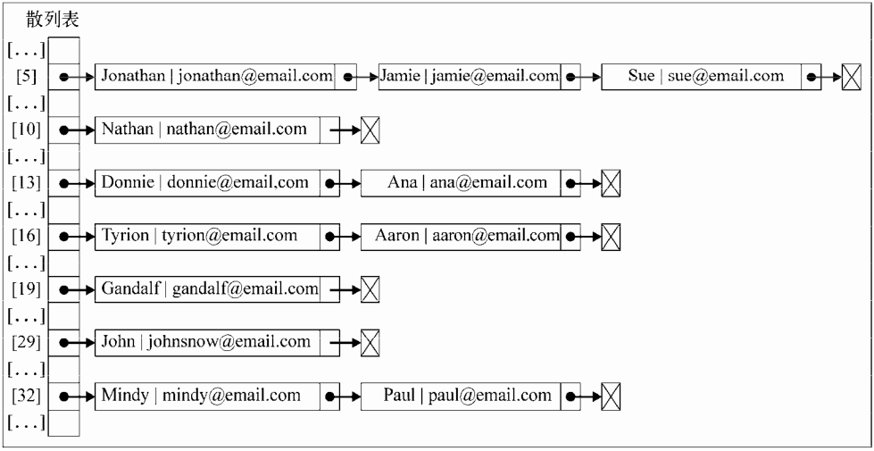
在位置5上，将会有包含三个元素的 LinkedList 实例；在位置13、16和32上，将会有包含两个元素的 LinkedList 实例；在位置10、19和29上，将会有包含单个元素的 LinkedList 实例。                             

为了实现一个使用了分离链接的 HashTable 实例，我们需要一个新的辅助类来表示将要加入LinkedList 实例的元素。我们管它叫 ValuePair 类（在 HashTable 类内部定义）：                    
```javascript
class ValuePair {
    constructor(key, value) {
        this.key = key;
        this.value = value;
    }
    toString() {
        return `[ ${this.key} - ${this.value} ]`
    }
}
```
这个类只会将 key 和 value 存储在一个 Object 实例中。我们也重写了 toString 方法，以便之后在浏览器控制台中输出结果。                

完整代码请见：[index2](./07、字典和散列表/02、散列表/index2.js)               
完整测试代码请见：[test2](./07、字典和散列表/02、散列表/test2.js)               


**7.2.3.2、线性探查**                
另一种解决冲突的方法是线性探查。当想向表中某个位置加入一个新元素的时候，如果索引为index的位置已经被占据了，
就尝试index+1的位置。如果index+1的位置也被占据了，就尝试index+2的位置，以此类推。             
让我们继续实现需要重写的三个方法。               
第一个是 put 方法：                           
```javascript
put(key, value) {
    let position = this.loseloseHashCode(key);
    if(this.table[position] === undefined) {
        this.table[position] = new ValuePair(key ,value);
    } else {
        let index = ++position;
        while (this.table[index] !==undefined) {
            index ++;
        }
        this.table[index] = new ValuePair(key, value);
    }
}
```

如果再次执行 [test2](./07、字典和散列表/02、散列表/test2.js) 
```
linkedList.put('Gandalf', 'gandalf@email.com');
linkedList.put('John', 'johnsnow@email.com');
linkedList.put('Tyrion', 'tyrion@email.com');
linkedList.put('Aaron', 'aaron@email.com');
linkedList.put('Donnie', 'donnie@email.com');
linkedList.put('Ana', 'ana@email.com');
linkedList.put('Jonathan', 'jonathan@email.com');
linkedList.put('Jamie', 'jamie@email.com');
linkedList.put('Sue', 'sue@email.com');
linkedList.put('Mindy', 'mindy@email.com');
linkedList.put('Paul', 'paul@email.com');
linkedList.put('Nathan', 'nathan@email.com');
```
节中插入数据的代码，下图展示使用了线性探查的散列表的最终结果：             
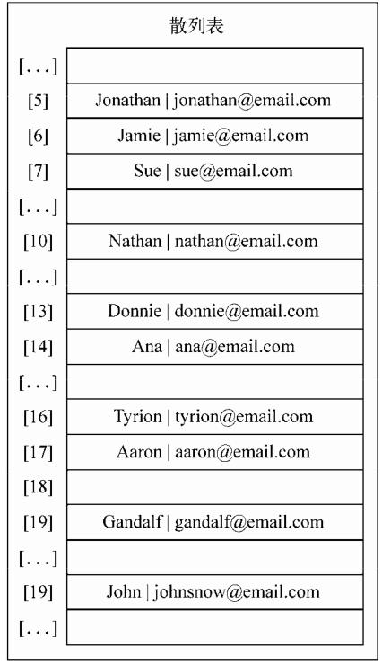

让我们来模拟一下散列表中的插入操作。                           
(1) 试着插入Gandalf。它的散列值是19，由于散列表刚刚被创建，位置19还是空的——可以在这里插入数据。                            
(2) 试着在位置29插入John。它也是空的，所以可以插入这个姓名。                 
(3) 试着在位置16插入Tyrion。它是空的，所以可以插入这个姓名。                    
(4) 试着插入Aaron，它的散列值也是16。位置16已经被Tyrion占据了，所以需要检查索引值为position+1的位置（16+1）。位置17是空的，所以可以在位置17插入Aaron。                        
(5) 接着，试着在位置13插入Donnie。它是空的，所以可以插入这个姓名。                 
(6) 想在位置13插入Ana，但是这个位置被占据了。因此在位置14进行尝试，它是空的，所以可以在这里插入姓名。                    
(7) 然后，在位置5插入Jonathan，这个位置是空的，所以可以插入这个姓名。                       
(8) 试着在位置5插入Jamie，但是这个位置被占了。所以跳至位置6，这个位置是空的，因此可以在这个位置插入姓名。                      
(9) 试着在位置5插入Sue，但是位置被占据了。所以跳至位置6，但也被占了。接着跳至位置7，这里是空的，所以可以在这里插入姓名。                   


第二个 get 方法：         
```javascript
get(key) {
    let position = this.loseloseHashCode(key);
    if(this.table[position] !== undefined) {
        if(this.table[position].key === key) {
            return table[position].value;
        } else {
            let index = ++position;
            while (this.table[index] === undefined || this.table[index].key !== key) {
                index++
            }
            if(this.table[index].key === key) {
                return this.table[index].value;
            }
        }
    }
}
```

第三个方法 remove :          
```javascript
remove(key) {
    let position = this.loseloseHashCode(key);
    if(this.table[position] !== undefined) {
        if(this.table[position].key === key) {
            this.table[position] = undefined;
            return true
        } else {
            let index = ++position;
            while (this.table[index] === undefined || this.table[index].key !== key) {
                index++
            }
            if(this.table[index].key === key) {
                this.table[index] = undefined;
                return true;
            }
        }
    }
    return false;
}
```

具体代码实现请见：[index3.js](./07、字典和散列表/02、散列表/index3.js)              
测试请见：[test3.js](./07、字典和散列表/02、散列表/test3.js)                    


**7.2.4、创建更好的散列函数**
们实现的“lose lose”散列函数并不是一个表现良好的散列函数，因为它会产生太多的冲突。如果我们使用这个函数的话，会产生各种各样的冲突。
一个表现良好的散列函数是由几个方面构成的：插入和检索元素的时间（即性能），当然也包括较低的冲突可能性。
我们可以在网上找到一些不同的实现方法，或者也可以实现自己的散列函数。                      

```javascript
djb2(key) {
    let hash = 5381;
    for (let i = 0; i < key.length; i++) {
        hash = hash * 33 + key.charCodeAt(i);
    }
    return hash % 1013;
}
```

## <div id='class08'>08章、树</div>                
树是一种分层数据的抽象模型。现实生活中最常见的树的例子是家谱，或是公司的组织架构图，如下图所示：                
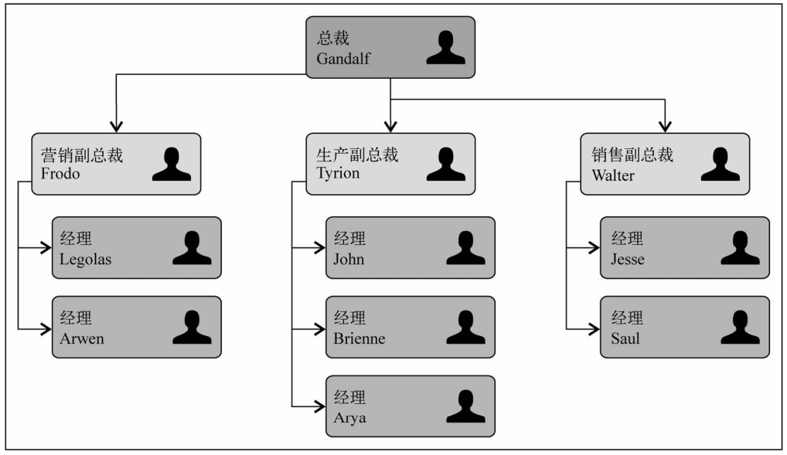           

### <div id='class08-01'>8.1、树的相关术语</div>
一个树结构包含一系列存在父子关系的节点。每个节点都有一个父节点（除了顶部的第一个节点）以及零个或多个子节点：              
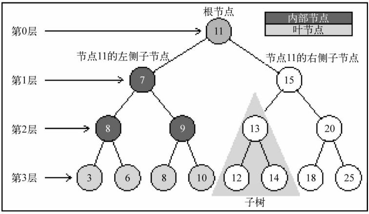
位于树顶部的节点叫作根节点（11）。它没有父节点。树中的每个元素都叫作节点，节点分为内部节点和外部节点。
至少有一个子节点的节点称为内部节点（7、5、9、15、13和20是内部节点）。
没有子元素的节点称为外部节点或叶节点（3、6、8、10、12、14、18和25是叶节点）。                           

一个节点可以有祖先和后代。一个节点（除了根节点）的祖先包括父节点、祖父节点、曾祖父节点等。
一个节点的后代包括子节点、孙子节点、曾孙节点等。例如，节点5的祖先有节点7和节点11，后代有节点3和节点6。                               

有关树的另一个术语是子树。子树由节点和它的后代构成。例如，节点13、12和14构成了上图中树的一棵子树。                

节点的一个属性是深度，节点的深度取决于它的祖先节点的数量。比如，节点3有3个祖先节点（5、7和11），它的深度为3。              

树的高度取决于所有节点深度的最大值。一棵树也可以被分解成层级。根节点在第0层，它的子节点在第1层，以此类推。上图中的树的高度为3（最大高度已在图中表示——第3层）。              


### <div id='class08-02'>8.2、二叉树和二叉搜索树</div>
二叉树中的节点最多只能有两个子节点：一个是左侧子节点，另一个是右侧子节点。这些定义有助于我们写出更高效的向/从树中插入、查找和删除节点的算法。二叉树在计算机科学中的应用非常广泛。                   

二叉搜索树（BST）是二叉树的一种，但是它只允许你在左侧节点存储（比父节点）小的值，在右侧节点存储（比父节点）大（或者等于）的值。上一节的图中就展现了一棵二叉搜索树。                 

**8.2.1 创建 BinarySearchTree 类**                 
结构申明：               
```javascript
class Node {
    constructor(key) {
        this.key = key;
        this.left = null;
        this.right = null;
    }
}

class BinarySearchTree {
    constructor() {
        this.root = null;
    }
}
```
二叉搜索树数据结构的组织方式:             
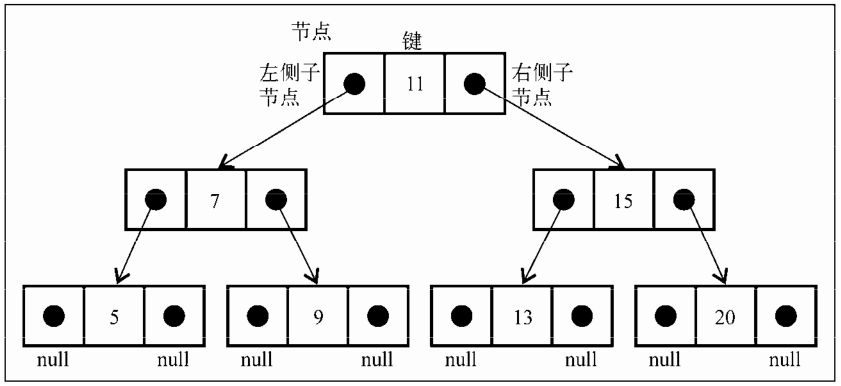               

具体实现的方法：
  insert(key) ：向树中插入一个新的键。             
  search(key) ：在树中查找一个键，如果节点存在，则返回 true ；如果不存在，则返回false 。              
  inOrderTraverse ：通过中序遍历方式遍历所有节点。             
  preOrderTraverse ：通过先序遍历方式遍历所有节点。                
  postOrderTraverse ：通过后序遍历方式遍历所有节点。               
  min ：返回树中最小的值/键。             
  max ：返回树中最大的值/键。             
  remove(key) ：从树中移除某个键。               


**8.2.2 向树中插入一个键**                  
第一步是创建用来表示新节点的 Node 类实例（行 {1} ）。只需要向构造函数传递我们想用来插入树的节点值，它的左指针和右指针的值会由构造函数自动设置为 null 。                
第二步要验证这个插入操作是否为一种特殊情况。这个特殊情况就是我们要插入的节点是树的第一个节点（行 {2} ）。如果是，就将根节点指向新节点。                  
第三步是将节点加在非根节点的其他位置。这种情况下，需要一个私有的辅助函数（行 {3} ），函数定义如下：                
```javascript
class Tool {
    static insertNode(node, newNode) {
        if(newNode.key < node.key) {
            if(node.left === null) {
                node.left = newNode;
            }else {
                this.insertNode(node.left, newNode);
            }
        } else {
            if(node.right === null) {
                node.right = newNode;
            } else {
                this.insertNode(node.right, newNode);
            }
        }
    }
}
```
下面是这个函数实现的步骤。               
  如果树非空，需要找到插入新节点的位置。因此，在调用 insertNode 方法时要通过参数
传入树的根节点和要插入的节点。                 
       
  如果新节点的键小于当前节点的键（现在，当前节点就是根节点）（行 {4} ），那么需要检
查当前节点的左侧子节点。如果它没有左侧子节点（行 {5} ），就在那里插入新的节点。
如果有左侧子节点，需要通过递归调用 insertNode 方法（行 {7} ）继续找到树的下一层。
在这里，下次将要比较的节点将会是当前节点的左侧子节点。                 

  如果节点的键比当前节点的键大，同时当前节点没有右侧子节点（行 {8} ），就在那里插
入新的节点（行 {9} ）。如果有右侧子节点，同样需要递归调用 insertNode 方法，但是要
用来和新节点比较的节点将会是右侧子节点。                

现在，来考虑下图所示树结构的情况：               
               

```javascript
let tree =new BinarySearchTree();
tree.insert(7);
tree.insert(15);
tree.insert(5);
tree.insert(3);
tree.insert(9);
tree.insert(8);
tree.insert(10);
tree.insert(13);
tree.insert(12);
tree.insert(14);
tree.insert(20);
tree.insert(18);
tree.insert(25);

// 同时我们想要插入一个值为 6 的键，执行下面的代码：
tree.insert(6);
```
下面的步骤将会被执行。                 
(1) 树不是空的，行 {3} 的代码将会执行。 insertNode 方法将会被调用（ root, key[6] ）。                    
(2) 算法将会检测行 {4} （ key[6] < root[11] 为真），并继续检测行 {5} （ node.left[7]不是 null ），
然后将到达行 {7} 并调用 insertNode （ node.left[7], key[6] ）。                  
(3) 将再次进入 insertNode 方法内部，但是使用了不同的参数。它会再次检测行 {4} （ key[6]< node[7] 为真），
然后再检测行 {5} （ node.left[5] 不是 null ），接着到达行 {7} ，调用insertNode （ node.left[5], key[6] ）。                           
(4) 将再一次进入 insertNode 方法内部。它会再次检测行 {4} （ key[6] < node[5] 为假），
然后到达行 {8} （ node.right 是 null ——节点5没有任何右侧的子节点），然后将会执行行 {9} ，在节点 5 的右侧子节点位置插入键 6 。                       
(5) 然后，方法调用会依次出栈，代码执行过程结束。                             

这是插入键6后的结果：         
               


### <div id='class08-03'>8.3 树的遍历</div>                 
遍历一棵树是指访问树的每个节点并对它们进行某种操作的过程。但是我们应该怎么去做呢？
应该从树的顶端还是底端开始呢？从左开始还是从右开始呢？访问树的所有节点有三种方式：**中序、先序和后序**。


**8.3.1 中序遍历**              
以从最小到最大的顺序访问所有节点。中序遍历的一种应用就是对树进行排序操作。                   
具体实现：           
```javascript
class BinarySearchTree{
    // ......
    inOrderTraverse(callback) {
        Tool.inOrderTraverseNode(this.root, callback);
    }
    //......
}

class Tool {
    //......
    static inOrderTraverseNode(node, callback) {
        if(node !== null) {
            this.inOrderTraverseNode(node.left, callback);
            callback(node.key);
            this.inOrderTraverseNode(node.right, callback);
        }
    }
}
```
inOrderTraverse 方法接收一个回调函数作为参数。回调函数用来定义我们对遍历到的每个节点进行的操作由于我们在BST中最常实现的算法是递归，
这里使用了一个私有的辅助函数，来接收一个节点和对应的回调函数作为参数。                                        

要通过中序遍历的方法遍历一棵树，首先要检查以参数形式传入的节点是否为 null                         

测试执行：               
```javascript
function printNode(value) {
    console.log(value)
}
tree.inOrderTraverse(printNode);
```

下面的图描绘了 inOrderTraverse 方法的访问路径：
               


**8.3.2 先序遍历**                  
先序遍历是以优先于后代节点的顺序访问每个节点的。先序遍历的一种应用是打印一个结构化的文档。                   
具体实现：           
```javascript
class BinarySearchTree{
    // ......
    // 中序遍历
    inOrderTraverse(callback) {
        Tool.inOrderTraverseNode(this.root, callback);
    }
    //......
}

class Tool {
    //......
    static preOrderTraverseNode(node, callback) {
        if(node !== null) {
            callback(node.key);
            this.preOrderTraverseNode(node.left, callback);
            this.preOrderTraverseNode(node.right, callback);
        }
    }
}
```

下面的图描绘了 preOrderTraverseNode 方法的访问路径：          
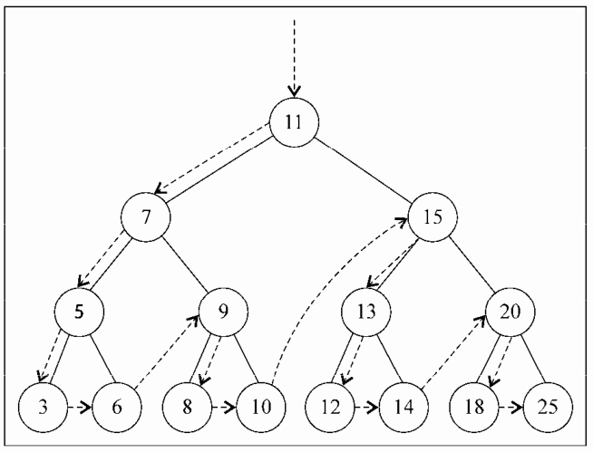                   


**8.3.3 后序遍历**                      
后序遍历则是先访问节点的后代节点，再访问节点本身。后序遍历的一种应用是计算一个目录和它的子目录中所有文件所占空间的大小。                    
具体实现：           
```javascript
class BinarySearchTree{
    // ......
    // 后序遍历
    postOrderTraverse(callback) {
        Tool.postOrderTraverseNode(this.root, callback);
    }
    //......
}

class Tool {
    //......
    static postOrderTraverseNode(node, callback) {
        if(node !== null) {
            this.postOrderTraverseNode(node.left, callback);
            this.postOrderTraverseNode(node.right, callback);
            callback(node.key);
        }
    }
}
```

下面的图描绘了 postOrderTraverse 方法的访问路径：
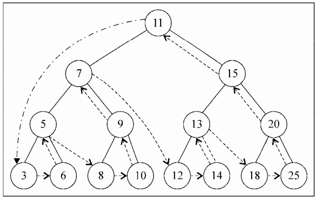               


### <div id='class08-04'>8.4 搜索树中的值</div>         
在树中，有三种经常执行的搜索类型：               
  最小值；             
  最大值；             
  搜索特定的值。                  


**8.4.1 搜索最小值和最大值**                 
我们使用下面的树作为示例：               
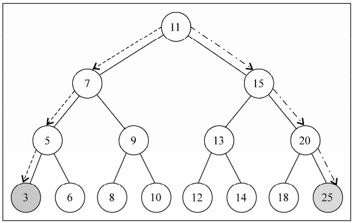               
看一眼树最后一层最左侧的节点，会发现它的值为3，这是这棵树中最小的键。如果你再看一眼树最右端的节点（同样是树的最后一层），
会发现它的值为25，这是这棵树中最大的键。这条信息在我们实现搜索树节点的最小值和最大值的方法时能给予我们很大的帮助。                          
具体实现：           
```javascript
class BinarySearchTree{
    // ......
    // 获取最小键
    min() {
        return Tool.minNode(this.root);
    }
    
    // 获取最大键
    max() {
        return Tool.maxNode(this.root);
    }
    //......
}

class Tool {
    //......
    static minNode(node) {
        if(node) {
            while (node && node.left !== null) {
                node = node.left
            }
            return node.key;
        }
        return null;
    }
    
    static maxNode(node) {
        if(node) {
            while (node && node.right !== null) {
                node = node.right;
            }  
            return node.key;
        }
        return null
    }
}
```

**8.4.2 搜索一个特定的值**                  
在之前的章节中，我们同样实现了 find 、 search 或 get 方法来查找数据结构中的一个特定的值（和之前章节中实现的 has 方法相似）。我们将同样在BST中实现搜索的方法，来看它的实现：                 
具体实现：           
```javascript
class BinarySearchTree{
    // ......
    // 搜索一个特定的值
    search(key) {
        return Tool.searchNode(this.root, key);
    }
    //......
}

class Tool {
    //......
    static searchNode(node, key) {
        if(node === null) {
            return false;
        }
        if(key < node.key) {
            return this.searchNode(node.left, key);
        } else if(key > node.key) {
            return this.searchNode(node.right, key);
        } else {
            return true;
        }
    }
}
```
对于结果的测试：            
```javascript
console.log(tree.search(1) ? 'Key 1 found.' : 'Key 1 not found.');
console.log(tree.search(8) ? 'Key 8 found.' : 'Key 8 not found.');
```
输出结果如下：
Value 1 not found.              
Value 8 found.              


**8.4.3 移除一个节点**                    
removeNode 方法的实现：                  
```javascript
class BinarySearchTree{
     // ......
    // 移除一个节点
    remove(key) {
        root = Tool.removeNode(this.root, key);
    }
     //......
}
 
class Tool {
     //......
    static removeNode(node, key) {
        if(node === null) {
            return null;
        }
        if(key < node.key) {
            node.left = this.removeNode(node.left, key);
            return node;
        } else if(key > node.key) {
            node.right = this.removeNode(node.right, key);
            return node;
        } else {
            //键等于 node.key 的情况
            //第一种情况： 一个叶节点
            if(node.left === null && node.right === null) {
                node = null;
                return node
            }
    
            //第二种情况： 一个只有一个子节点的节点
            if(node.left === null) {
                node = node.right;
                return node;
            } else if(node.right === null) {
                node = node.left;
                return node;
            }
    
            // 第三种情况： 一个有两个子节点的节点
            let aux = this.findMinNode(node.right);
            node.key = aux.key;
            node.right = this.removeNode(ndoe.right, aux.key);
            return node;
        }
    }
    
    static findMinNode(node) {
        if(node) {
            while (node && node.left !== null) {
                node = node.left
            }
            return node;
        }
        return null;
    }
}
```
说明：                 
- 1. 移除一个叶节点                
下图展现了移除一个叶节点的过程：                
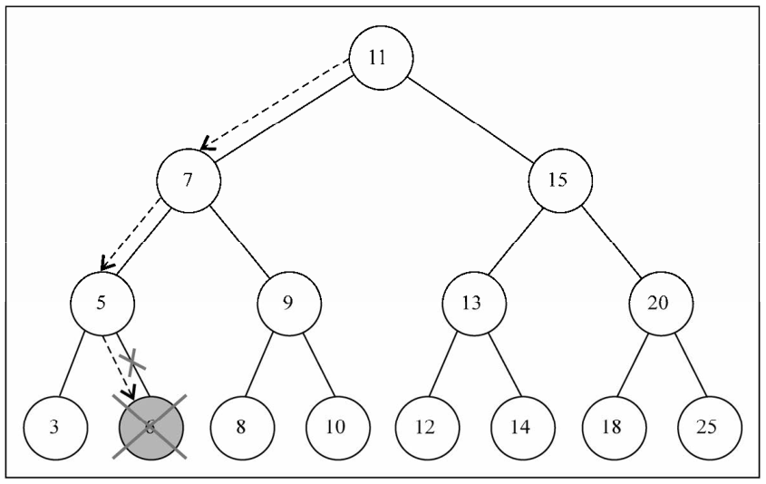                   

- 2. 移除有一个左侧或右侧子节点的节点               
下图展现了移除只有一个左侧子节点或右侧子节点的节点的过程：               
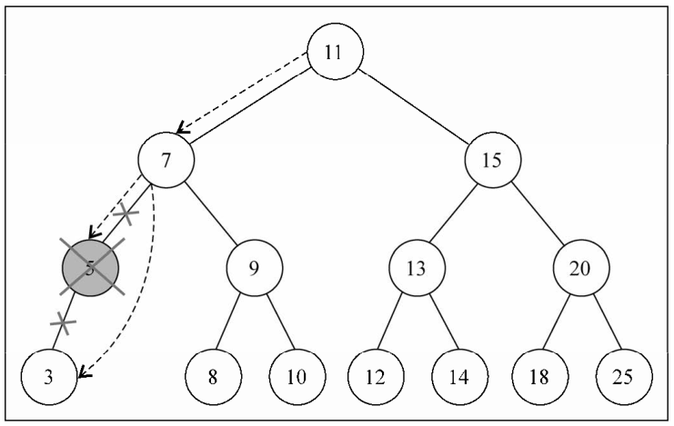               


- 3. 移除有两个子节点的节点                
现在是第三种情况，也是最复杂的情况，那就是要移除的节点有两个子节点——左侧子节点和右侧子节点。要移除有两个子节点的节点，需要执行四个步骤。                   
(1) 当找到了需要移除的节点后，需要找到它右边子树中最小的节点（它的继承者——行{18} ）。                
(2) 然后，用它右侧子树中最小节点的键去更新这个节点的值（行 {19} ）。通过这一步，我们改变了这个节点的键，也就是说它被移除了。             
(3) 但是，这样在树中就有两个拥有相同键的节点了，这是不行的。要继续把右侧子树中的最小节点移除，毕竟它已经被移至要移除的节点的位置了（行 {20} ）。                   
(4) 最后，向它的父节点返回更新后节点的引用（行 {21} ）。                   

下图展现了移除有两个子节点的节点的过程：                
                   

[本节代码示例](./08章、树/02、二叉树和二叉搜索树/)


## <div id='class09'>09章、图</div>                
非线性数据结构             
### <div id='class09-01'>9.1 图的相关术语</div>
图是网络结构的抽象模型。图是一组由边连接的节点（或顶点）。学习图是重要的，因为任何二元关系都可以用图来表示。                      
我们还可以使用图来表示道路、航班以及通信状态，如下图所示：               
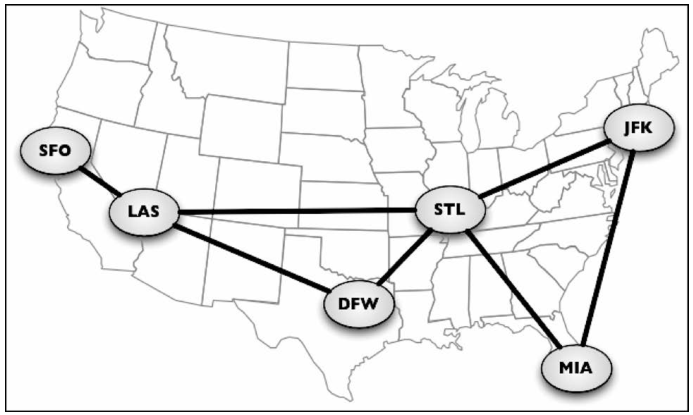   
            
一个图G = (V, E)由以下元素组成                
  V：一组顶点
  E：一组边，连接V中的顶点
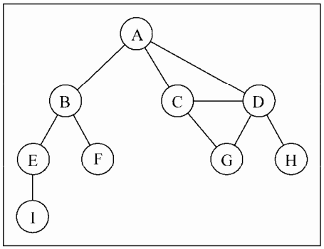                   

先了解一下图的一些术语。                
由一条边连接在一起的顶点称为相邻顶点。比如，A和B是相邻的，A和D是相邻的，A和C是相邻的，A和E不是相邻的。
一个顶点的度是其相邻顶点的数量。比如，A和其他三个顶点相连接，因此，A的度为3；E和其他两个顶点相连，因此，E的度为2。                    
路径是顶点v 1 , v 2 ,…,v k 的一个连续序列，其中v i 和v i+1 是相邻的。以上一示意图中的图为例，其中包含路径A B E I和A C D G。                  
简单路径要求不包含重复的顶点。举个例子，A D G是一条简单路径。除去最后一个顶点（因为它和第一个顶点是同一个顶点），环也是一个简单路径，比如A D C A（最后一个顶点重新回到A）。                    
如果图中不存在环，则称该图是无环的。如果图中每两个顶点间都存在路径，则该图是连通的。                            

**有向图和无向图**                 
图可以是无向的（边没有方向）或是有向的（有向图）。如下图所示，有向图的边有一个方向：                  
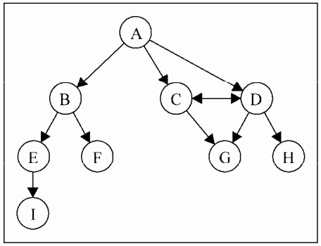                   
如果图中每两个顶点间在双向上都存在路径，则该图是强连通的。例如，C和D是强连通的，而A和B不是强连通的。                            

图还可以是未加权的（目前为止我们看到的图都是未加权的）或是加权的。如下图所示，加权图的边被赋予了权值：                             
                        


### <div id='class09-02'>9.2 图的表示</div>                 
从数据结构的角度来说，我们有多种方式来表示图。在所有的表示法中，不存在绝对正确的方式。图的正确表示法取决于待解决的问题和图的类型。               

**9.2.1 邻接矩阵**              
图最常见的实现是邻接矩阵。每个节点都和一个整数相关联，该整数将作为数组的索引。我们用一个二维数组来表示顶点之间的连接。
如果索引为i的节点和索引为j的节点相邻，则array[i][j]=== 1，否则array[i][j] === 0，如下图所示：
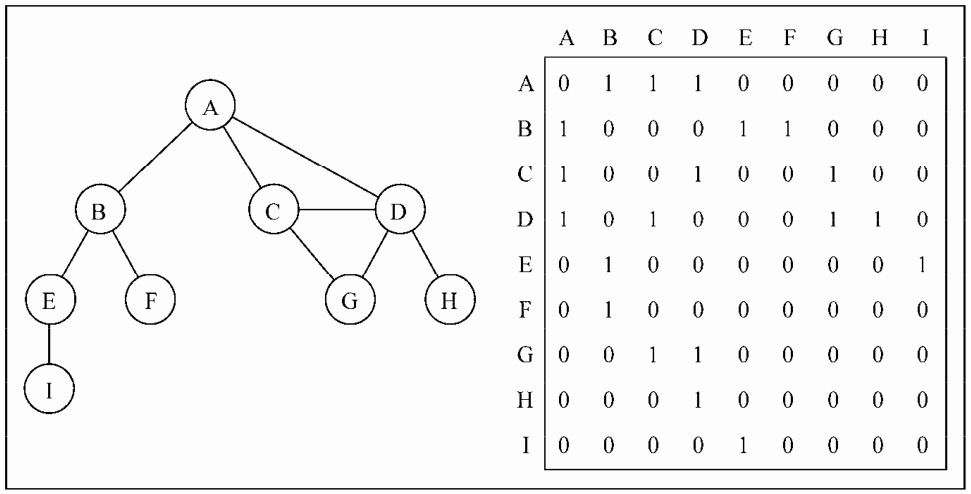                   
不是强连通的图（稀疏图）如果用邻接矩阵来表示，则矩阵中将会有很多0，这意味着我们浪费了计算机存储空间来表示根本不存在的边。
邻接矩阵表示法不够好的另一个理由是，图中顶点的数量可能会改变，而2维数组不太灵活。                       

**9.2.2 邻接表**               
我们也可以使用一种叫作邻接表的动态数据结构来表示图。邻接表由图中每个顶点的相邻顶点列表所组成。存在好几种方式来表示这种数据结构。我们可以用列表（数组）、链表，甚至是散列表或是字典来表示相邻顶点列表。             
下面的示意图展示了邻接表数据结构。           
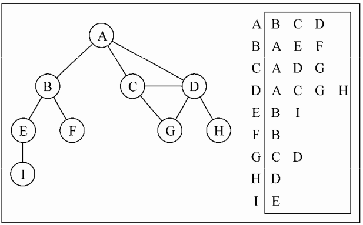               
尽管邻接表可能对大多数问题来说都是更好的选择，但以上两种表示法都很有用，且它们有着不同的性质（例如，要找出顶点v和w是否相邻，使用邻接矩阵会比较快）。
在本书的示例中，我们将会使用邻接表表示法。                   

**9.2.3 关联矩阵**                  
我们还可以用关联矩阵来表示图。在关联矩阵中，矩阵的行表示顶点，列表示边。如下图所示，我们使用二维数组来表示两者之间的连通性，
如果顶点v是边e的入射点，则array[v][e] === 1；否则，array[v][e] === 0。                   
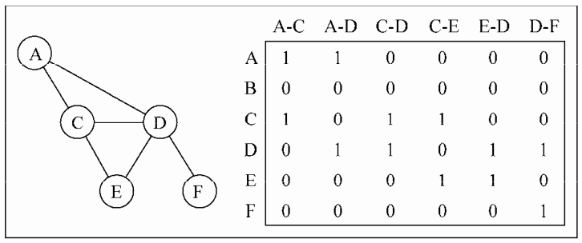           

### <div id='class09-03'>9.3 创建图类</div>             
具体实现：           
```javascript
let Dictionary = require('../07、字典和散列表/01、字典/index');

class Graph {
    constructor() {
        this.vertices = [];
        this.adjList = new Dictionary();
    }

    // 一个用来向图中添加一个新的顶点（因为图实例化后是空的）
    addVertex(v) {
        this.vertices.push(v);
        this.adjList.set(v, []);
    }

    // 用来添加顶点之间的边
    addEdge(v, w) {
        this.adjList.get(v).push(w);
        this.adjList.get(w).push(v);
    }

    toString() {
        let s = '';
        for (let i = 0; i < this.vertices.length; i++) {
            s += this.vertices[i] + ' -> ';
            let neighbors = this.adjList.get(this.vertices[i]);
            for (let j = 0; j < neighbors.length; j++) {
                s += neighbors[j] + ' ';
            }
            s += '\n';
        }
        return s;
    }
}

module.exports = Graph;
```

测试代码：           
```javascript
const Graph = require('./index');

let graph = new Graph();
let myVertices = ['A','B','C','D','E','F','G','H','I']; //{7}
for (let i=0; i<myVertices.length; i++){ //{8}
    graph.addVertex(myVertices[i]);
}
graph.addEdge('A', 'B'); //{9}
graph.addEdge('A', 'C');
graph.addEdge('A', 'D');
graph.addEdge('C', 'D');
graph.addEdge('C', 'G');
graph.addEdge('D', 'G');
graph.addEdge('D', 'H');
graph.addEdge('B', 'E');
graph.addEdge('B', 'F');
graph.addEdge('E', 'I');

console.log(graph.toString());
```
我们为邻接表表示法构建了一个字符串。首先，迭代 vertices 数组列表（行 {10} ），将顶点的名字加入字符串中。
接着，取得该顶点的邻接表（行 {11} ），同样也迭代该邻接表（行 {12} ），将相邻顶点加入我们的字符串。
邻接表迭代完成后，给我们的字符串添加一个换行符（行 {13} ），这样就可以在控制台看到一个漂亮的输出了。               


### <div id='class09-04'>9.4 图的遍历</div>    
有两种算法可以对图进行遍历：广度优先搜索（Breadth-First Search，BFS）和深度优先搜索（Depth-First Search，DFS）。                      
图遍历算法的思想是必须追踪每个第一次访问的节点，并且追踪有哪些节点还没有被完全探索。对于两种图遍历算法，都需要明确指出第一个被访问的顶点。                   
完全探索一个顶点要求我们查看该顶点的每一条边。对于每一条边所连接的没有被访问过的顶点，将其标注为被发现的，并将其加进待访问顶点列表中。                     
     
              
当要标注已经访问过的顶点时，我们用三种颜色来反映它们的状态。              
  白色：表示该顶点还没有被访问。              
  灰色：表示该顶点被访问过，但并未被探索过。                
  黑色：表示该顶点被访问过且被完全探索过。                 
这就是之前提到的务必访问每个顶点最多两次的原因。                    


**9.4.1 广度优先搜索**                
广度优先搜索算法会从指定的第一个顶点开始遍历图，先访问其所有的相邻点，就像一次访问图的一层。换句话说，就是先宽后深地访问顶点，如下图所示：
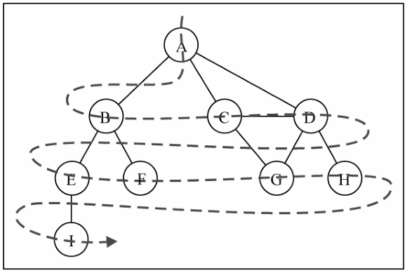                   

以下是从顶点v开始的广度优先搜索算法所遵循的步骤。               
(1) 创建一个队列Q。                
(2) 将v标注为被发现的（灰色），并将v入队列Q。              
(3) 如果Q非空，则运行以下步骤：          
    (a) 将u从Q中出队列；               
    (b) 将标注u为被发现的（灰色）；              
    (c) 将u所有未被访问过的邻点（白色）入队列；                
    (d) 将u标注为已被探索的（黑色）。             

具体实现：           
```javascript
let Dictionary = require('../07、字典和散列表/01、字典/index');
let Queue = require('../04章、队列/02、优先队列/index');

class Graph {
    constructor() {
        this.vertices = [];
        this.adjList = new Dictionary();
    }
    // ......

    // 广度优先遍历算法
    bfs(v, callback) {
        let color = this.initializeColor(), queue = new Queue();
        queue.enqueue(v);
        while (!queue.isEmpty()) {
            let u = queue.dequeue(), neighbors = this.adjList.get(u);
            color[u] = 'grey';
            for (let i = 0; i < neighbors.length; i++) {
                let w = neighbors[i];
                if (color[w] === 'white') {
                    color[w] = 'grey';
                    queue.enqueue(w);
                }
            }
            color[u] = 'black';
            if(callback) {
                callback(u);
            }
        }
    }

    toString() {
        let s = '';
        for (let i = 0; i < this.vertices.length; i++) {
            s += this.vertices[i] + ' -> ';
            let neighbors = this.adjList.get(this.vertices[i]);
            for (let j = 0; j < neighbors.length; j++) {
                s += neighbors[j] + ' ';
            }
            s += '\n';
        }
        return s;
    }

    initializeColor() {
        let color = [];
        for (let i = 0; i < this.vertices.length; i++) {
            color[this.vertices[i]] = 'white';
        }
        return color;
    }
}

module.exports = Graph;
```
广度优先搜索和深度优先搜索都需要标注被访问过的顶点。为此，我们将使用一个辅助数组color 。
由于当算法开始执行时，所有的顶点颜色都是白色（行 {1} ），所以我们可以创建一个辅助函数 initializeColor ，为这两个算法执行此初始化操作。                          

让我们深入学习广度优先搜索方法的实现。我们要做的第一件事情是用 initializeColor函数来将 color 数组初始化为 white （行 {2} ）。
我们还需要声明和创建一个 Queue 实例（行 {3} ），它将会存储待访问和待探索的顶点。                              

照着本章开头解释过的步骤， bfs 方法接受一个顶点作为算法的起始点。起始顶点是必要的，我们将此顶点入队列（行 {4} ）。                          

如果队列非空（行 {5} ），我们将通过出队列（行 {6} ）操作从队列中移除一个顶点，并取得一个包含其所有邻点的邻接表（行 {7} ）。
该顶点将被标注为 grey （行 {8} ），表示我们发现了它（但还未完成对其的探索）。                        

对于u（行 {9} ）的每个邻点，我们取得其值（该顶点的名字——行 {10} ），如果它还未被访问过（颜色为 white ——行 {11} ），
则将其标注为我们已经发现了它（颜色设置为 grey ——行{12} ），并将这个顶点加入队列中（行 {13} ），这样当其从队列中出列的时候，我们可以完成对其的探索。                     

当完成探索该顶点和其相邻顶点后，我们将该顶点标注为已探索过的（颜色设置为black ——行 {14} ）。                       

我们实现的这个 bfs 方法也接受一个回调（我们在第8章中遍历树时使用了一个相似的方法）。这个参数是可选的，如果我们传递了回调函数（行 {15} ），会用到它。                            

让我们执行下面这段代码来测试一下这个算法：                   
```javascript
function printNode(value) {
    console.log('Visited vertex: ' + value);
}
graph.bfs(myVertices[0], printNode);
```
输出结果如下：             
```
Visited vertex: A
Visited vertex: B
Visited vertex: C
Visited vertex: D
Visited vertex: E
Visited vertex: F
Visited vertex: G
Visited vertex: H
Visited vertex: I
```

**1. 使用BFS寻找最短路径**                      
到目前为止，我们只展示了BFS算法的工作原理。我们可以用该算法做更多事情，而不只是输出被访问顶点的顺序。                    

给定一个图G和源顶点v，找出对每个顶点u，u和v之间最短路径的距离（以边的数量计）。                  
对于给定顶点v，广度优先算法会访问所有与其距离为1的顶点，接着是距离为2的顶点，以此类推。所以，可以用广度优先算法来解这个问题。                            
我们可以修改 bfs 方法以返回给我们一些信息：                
  从v到u的距离d[u]；             
  前溯点pred[u]，用来推导出从v到其他每个顶点u的最短路径。                 
让我们来看看改进过的广度优先方法的实现：                

具体实现：           
```javascript
let Dictionary = require('../07、字典和散列表/01、字典/index');
let Queue = require('../04章、队列/02、优先队列/index');

class Graph {
    constructor() {
        this.vertices = [];
        this.adjList = new Dictionary();
    }
    // ......
    // 使用BFS寻找最短路径
    BFS(v) {
        let color = initializeColor(),
            queue = new Queue(),
            d = [], //{1}
            pred = []; //{2}
        queue.enqueue(v);
        for (let i=0; i<this.vertices.length; i++){ //{3}
            d[this.vertices[i]] = 0; //{4}
            pred[this.vertices[i]] = null; //{5}
        }
        while (!queue.isEmpty()) {
            let u = queue.dequeue(),
                neighbors = adjList.get(u);
            color[u] = 'grey';
            for (let i = 0; i < neighbors.length; i++) {
                let w = neighbors[i];
                if (color[w] === 'white') {
                    color[w] = 'grey';
                    d[w] = d[u] + 1; //{6}
                    pred[w] = u; //{7}
                    queue.enqueue(w);
                }
            }
            color[u] = 'black';
        }
        return { //{8}
            distances: d,
            predecessors: pred
        };
    }

}

module.exports = Graph;
```

我们还需要声明数组 d （行 {1} ）来表示距离，以及 pred 数组来表示前溯点。下一步则是对图中的每一个顶点，用 0 来初始化数组 d （行 {4} ），用 null 来初始化数组 pred 。                    
当我们发现顶点 u 的邻点 w 时，则设置 w 的前溯点值为 u （行 {7} ）。我们还通过给 d[u] 加1来设置 v 和 w 之间的距离（ u 是 w 的前溯点， d[u] 的值已经有了）。                  
方法最后返回了一个包含 d 和 pred 的对象（行 {8} ）。
现在，我们可以再次执行 BFS 方法，并将其返回值存在一个变量中：                   
```javascript
let shortestPathA = graph.BFS(myVertices[0]);
console.log(shortestPathA);
```
对顶点 A 执行 BFS 方法，以下将会是输出：                
```
distances: [A: 0, B: 1, C: 1, D: 1, E: 2, F: 2, G: 2, H: 2 , I: 3],
predecessors: [A: null, B: "A", C: "A", D: "A", E: "B", F: "B", G:"C", H: "D", I: "E"]
```
这意味着顶点 A 与顶点 B 、 C 和 D 的距离为 1 ；与顶点 E 、 F 、 G 和 H 的距离为 2 ；与顶点 I 的距离为 3 。                 

通过前溯点数组，我们可以用下面这段代码来构建从顶点 A 到其他顶点的路径：                   
```javascript
let fromVertex = myVertices[0]; //{9}
for (let i=1; i<myVertices.length; i++){ //{10}
    let toVertex = myVertices[i], //{11}
        path = new Stack(); //{12}
    for (let v=toVertex; v!== fromVertex;
         v=shortestPathA.predecessors[v]) { //{13}
        path.push(v); //{14}
    }
    path.push(fromVertex); //{15}
    let s = path.pop(); //{16}
    while (!path.isEmpty()){ //{17}
        s += ' - ' + path.pop(); //{18}
    }
    console.log(s); //{19}
}
```
我们用顶点 A 作为源顶点（行 {9} ）。对于每个其他顶点（除了顶点 A ——行 {10} ），我们会计算顶点 A 到它的路径。我们从顶点数组得到 toVertex （行 {11} ），然后会创建一个栈来存储路径值（行 {12} ）。                  
接着，我们追溯 toVertex 到 fromVertex 的路径{行 {13} }。变量 v 被赋值为其前溯点的值，这样我们能够反向追溯这条路径。将变量 v 添加到栈中（行 {14} ）。最后，源顶点也会被添加到栈中，以得到完整路径。                  
这之后，我们创建了一个 s 字符串，并将源顶点赋值给它（它是最后一个加入栈中的，所以它是第一个被弹出的项 ——行 {16} ）。当栈是非空的，我们就从栈中移出一个项并将其拼接到字符串 s 的后面（行 {18} ）。最后（行 {19} ）在控制台上输出路径。                    
执行该代码段，我们会得到如下输出：               
```
A - B
A - C
A - D
A - B - E
A - B - F
A - C - G
A - D - H
A - B - E - I
```
这里，我们得到了从顶点 A 到图中其他顶点的最短路径（衡量标准是边的数量）。              


**9.4.2 深度优先搜索**                
深度优先搜索算法将会从第一个指定的顶点开始遍历图，沿着路径直到这条路径最后一个顶点被访问了，接着原路回退并探索下一条路径。                           
换句话说，它是先深度后广度地访问顶点，如下图所示：                   
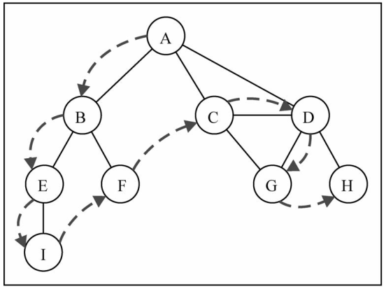               

深度优先搜索算法不需要一个源顶点。在深度优先搜索算法中，若图中顶点v未访问，则访问该顶点v。                  
要访问顶点v，照如下步骤做。                               
(1) 标注v为被发现的（灰色）。               
(2) 对于v的所有未访问的邻点w：                  
    (a) 访问顶点w。              
(3) 标注v为已被探索的（黑色）。              

具体算法实现：                         
```javascript
class Graph {
    constructor() {
        this.vertices = [];
        this.adjList = new Dictionary();
    }
    
    // 深度优先算法实现
    dfs(callback) {
        let color = this.initializeColor();
        for(let i = 0;i<this.vertices.length; i++) {
            if(color[this.vertices[i]] === 'white') {
                this.dfsVisit(this.vertices[i], color, callback);
            }
        }
    }
    
    dfsVisit(u, color, callback) {
        color[u] = 'grey';
        if(callback) {
            callback(u);
        }
        let neighbors = this.adjList.get(u);
        for (let i = 0; i< neighbors.length; i++) {
            let w = neighbors[i];
            if(color[w] === 'white') {
                this.dfsVisit(w, color, callback);
            }
        }
        color[u] = 'black';
    }
}
```
其他省略                    
让我们执行下面的代码段来测试一下 dfs 方法：                        
graph.dfs(printNode);                   
输出如下：                   
```
Visited vertex: A
Visited vertex: B
Visited vertex: E
Visited vertex: I
Visited vertex: F
Visited vertex: C
Visited vertex: D
Visited vertex: G
Visited vertex: H
```

下面这个示意图展示了该算法每一步的执行过程：                      
                       


**1. 探索深度优先算法**                     
到目前为止，我们只是展示了深度优先搜索算法的工作原理。我们可以用该算法做更多的事情，而不只是输出被访问顶点的顺序。                   

对于给定的图G，我们希望深度优先搜索算法遍历图G的所有节点，构建“森林”（有根树的一个集合）以及一组源顶点（根），
并输出两个数组：发现时间和完成探索时间。我们可以修改dfs 方法来返回给我们一些信息：                         

  顶点u的发现时间d[u]；                
  当顶点u被标注为黑色时，u的完成探索时间f[u]；                
  顶点u的前溯点p[u]。             

算法函数的具体实现                       
```javascript
// 深度优先算法的优化
DFS() {
    let color = this.initializeColor(), d = [], f = [], p = [];
    this.time = 0;
    for (let i = 0; i < this.vertices.length; i++) {
        f[this.vertices[i]] = 0;
        d[this.vertices[i]] = 0;
        p[this.vertices[i]] = null;
    }

    for (let i = 0; i < this.vertices.length; i++) {
        if (color[this.vertices[i]] === 'white') {
            this.DFSVisit(this.vertices[i], color, d, f, p);
        }
    }

    return {
        discovery: d,
        finished: f,
        predecessors: p
    }
}

DFSVisit(u, color, d, f, p) {
    console.log('discovered ' + u);
    color[u] = 'grey';
    d[u] = ++this.time;
    let neighbors = this.adjList.get(u);
    for (let i = 0; i < neighbors.length; i++) {
        let w = neighbors[i];
        if (color[w] === 'white') {
            p[w] = u;
            this.DFSVisit(w, color, d, f, p);
        }
    }
    color[u] = 'black';
    f[u] = ++this.time;
    console.log('explored ' + u);
}
```

对于改进过的深度优先搜索，有两点需要我们注意：                     
  时间（ time ）变量值的范围只可能在图顶点数量的一倍到两倍之间；                   
  对于所有的顶点 u ，d[u]<f[u]（意味着，发现时间的值比完成时间的值小，完成时间意思是所有顶点都已经被探索过了）。                        
在这两个假设下，我们有如下的规则： `1 ≤ d[u] < f[u] ≤ 2|V|`                          
                                   

[具体代码请见本节示例](./09章、图/)                      


## <div id="class10">10章、排序和搜索算法</div>

### <div id="class10-01">10.1 排序算法</div>                    
在开始排序算法之前，我们先创建一个数组（列表）来表示待排序和搜索的数据结构。                  
```javascript
class ArrayList {
    constructor() {
        this.array = [];
    }
    
    insert(item) {
        this.array.push(item);
    }
    
    toString() {
        return this.array.join();
    }
}
```

#### 10.1.1 冒泡排序                                         
人们开始学习排序算法时，通常都先学冒泡算法，因为它在所有排序算法中最简单。然而，从运行时间的角度来看，冒泡排序是最差的一个。                  
冒泡排序比较任何两个相邻的项，如果第一个比第二个大，则交换它们。                    
```javascript
//冒泡法排序
bubbleSort() {
    let length = this.array.length;
    for(let i = 0; i < length; i++) {
        for (let j = 0; j < length;j++) {
            if(this.array[j]> this.array[j+1]) {
                let temp = this.array[j];
                this.array[j] = this.array[j+1];
                this.array[j+1] = temp;
            }
        }
    }
}
```
下面这个示意图展示了冒泡排序的工作过程：                    
                     

测试代码如下：             
```javascript
const ArrayList = require('./index');

function createNonSortedArray(size){
    let array = new ArrayList();
    for (let i = size; i> 0; i--){
        array.insert(i);
    }
    return array;
}
let array = createNonSortedArray(5);
console.log(array.toString());
array.bubbleSort();
console.log(array.toString());
```

**改进后的冒泡排序**                    
如果从内循环减去外循环中已跑过的轮数，就可以避免内循环中所有不必要的比较                        
代码示例如下：             
```javascript
// 改进后的冒泡法排序
modifiedBubbleSort() {
    let length = this.array.length;
    for(let i = 0; i < length; i++) {
        for (let j = 0; j < length-1-i; j++) {
            if(this.array[j]> this.array[j+1]) {
                let temp = this.array[j];
                this.array[j] = this.array[j+1];
                this.array[j+1] = temp;
            }
        }
    }
}
```
下面这个示意图展示了改进后的冒泡排序算法是如何执行的：                             
                             
                           


#### 10.1.2 选择排序                                     
选择排序算法是一种原址比较排序算法。选择排序大致的思路是找到数据结构中的最小值并将其放置在第一位，接着找到第二小的值并将其放在第二位，以此类推。                    
具体代码实现示例：           
```javascript
// 选择排序
selectionSort() {
    let length = this.array.length, indexMin;
    for(let i = 0; i < length -1; i++) {
        indexMin = i;
        for(let j = i; j < length; j++) {
            if(this.array[indexMin] > this.array[j]) {
                indexMin = j;
            }
        }
        if(i !== indexMin) {
            this.swap(i, indexMin);
        }
    }
}

swap(index1, index2) {
    let temp = this.array[index1];
    this.array[index1] = this.array[index2];
    this.array[index2] = temp;
}
```
 
用以下代码段来测试选择排序算法：                        
```javascript
array = createNonSortedArray(5);
console.log(array.toString());
array.selectionSort();
console.log(array.toString());
```
选择排序同样也是一个复杂度为O(n 2 )的算法。和冒泡排序一样，它包含有嵌套的两个循环，这导致了二次方的复杂度。                                  
算法执行图如下                 
                     


#### 10.1.3 插入排序                        
插入排序每次排一个数组项，以此方式构建最后的排序数组。假定第一项已经排序了，接着，它和第二项进行比较，第二项是应该待在原位还是插到第一项之前呢？
这样，头两项就已正确排序，接着和第三项比较（它是该插入到第一、第二还是第三的位置呢？），以此类推。                       

具体代码实现：             
```javascript
// 插入法排序
insertionSort() {
    let length = this.array.length, j, temp;
    for(let i = 1; i < length; i++) {
        j = i ;
        temp = this.array[i];
        while (j > 0 && this.array[j -1] > temp) {
            this.array[j] = this.array[j - 1];
            j--;
        }
        this.array[j] = temp;
    }
}
```
下面的示意图展示了一个插入排序的实例：                 
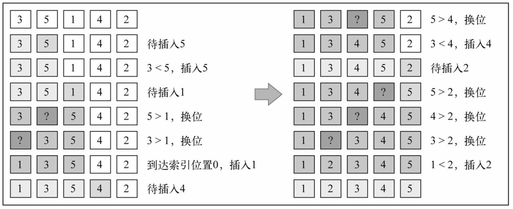                     


#### 10.1.4 归并排序                        
归并排序是第一个可以被实际使用的排序算法。你在本书中学到的前三个排序算法性能不好，但归并排序性能不错，其复杂度为O(nlog n )。                             

归并排序是一种分治算法。其思想是将原始数组切分成较小的数组，直到每个小数组只有一个位置，接着将小数组归并成较大的数组，直到最后只有一个排序完毕的大数组。                        

由于是分治法，归并排序也是递归的：           
```javascript
// 归并排序
mergeSort() {
    this.array = this.mergeSortRec(this.array);
}
mergeSortRec(array) {
    let length = this.array.length;
    if(length === 1) {
        return this.array;
    }
    let mid = Math.floor(length/2),
        left = this.array.slice(0, mid),
        right = this.array.slice(mid, length);
    return this.merge(this.mergeSortRec(left), this.mergeSortRec(right))
}
merge(left, right) {
    let result = [], il = 0, ir = 0;
    while (il < left.length && ir < right.length) {
        if(left[il] < right[ir]) {
            result.push(left[il++]);
        }else {
            result.push(right[ir++]);
        }
    }
    while (il < left.length) {
        result.push(left[il++]);
    }
    while (ir <right.length) {
        result.push(right[ir++]);
    }
    return result;
}
```

如果执行 mergeSort 函数，下图是具体的执行过程：                   
                     


#### 10.1.5 快速排序                    
快速排序也许是最常用的排序算法了。它的复杂度为O(nlog n )，且它的性能通常比其他的复杂度为O(nlog n )的排序算法要好。                         
和归并排序一样，快速排序也使用分治的方法，将原始数组分为较小的数组（但它没有像归并排序那样将它们分割开）。                   
快速排序比到目前为止你学过的其他排序算法要复杂一些。                  
(1) 首先，从数组中选择中间一项作为主元。                  
(2) 创建两个指针，左边一个指向数组第一个项，右边一个指向数组最后一个项。移动左指针直到我们找到一个比主元大的元素，接着，
移动右指针直到找到一个比主元小的元素，然后交换它们，重复这个过程，直到左指针超过了右指针。
这个过程将使得比主元小的值都排在主元之前，而比主元大的值都排在主元之后。这一步叫作划分操作。                          
(3) 接着，算法对划分后的小数组（较主元小的值组成的子数组，以及较主元大的值组成的子数组）重复之前的两个步骤，直至数组已完全排序。                          
具体实现过程：                 
```javascript
//快速排序
quickSort() {
    this.quick(this.array, 0, this.array.length - 1);
}
quick(array, left, right) {
    let index;
    if(array.length > 1) {
        index = this.partition(array, left, right);
        if(left < index -1) {
            this.quick(array, left, index - 1);
        }
        if(index < right) {
            this.quick(array, index, right);
        }
    }
}
//划分过程
partition(array, left, right) {
    let pivot = array[Math.floor((right + left) / 2)], i = left, j = right;
    while (i <= j) {
        while (array[i] < pivot) {
            i++;
        }
        while (array[j] > pivot) {
            j++;
        }
        if(i <= j) {
            this.swapQuickStort(array, i, j);
            i++;
            j++;
        }
    }
    return i;
}
swapQuickStort(array, index1, index2) {
    let temp = array[index1];
    array[index1] = array[index2];
    array[index2] = temp;
}
```
让我来一步步地看一个快速排序的实际例子：                    
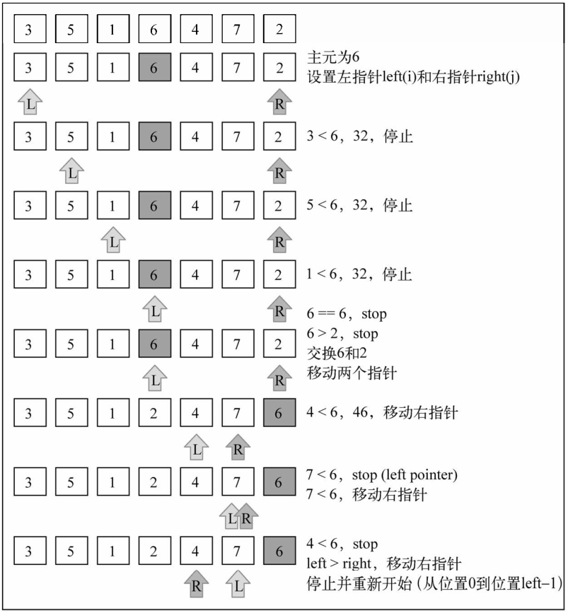                 
给定数组 [3, 5, 1, 6, 4, 7, 2] ，前面的示意图展示了划分操作的第一次执行。                            
下面的示意图展示了对有较小值的子数组执行的划分操作（注意7和6不包含在子数组之内）：                  
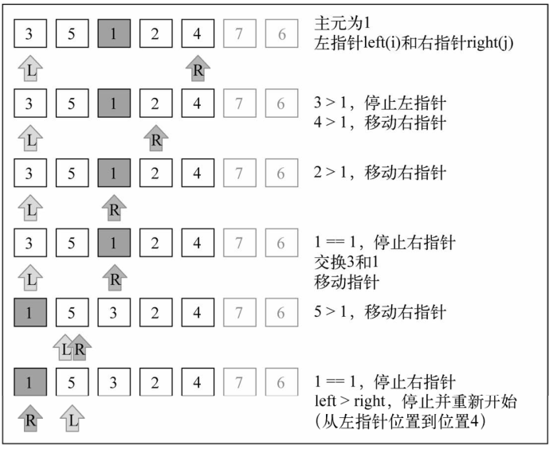                 
接着，我们继续创建子数组，请看下图，但是这次操作是针对上图中有较大值的子数组（有1的那个较小子数组不用再划分了，因为它仅含有一个项）。                         
                                            
子数组（ [2, 3, 5, 4] ）中的较小子数组（ [2, 3] ）继续进行划分（算法代码中的行 {5} ）：                   
                     
然后子数组（ [2, 3, 5, 4] ）中的较大子数组（ [5, 4] ）也继续进行划分（算法中的行），示意图如下：                     
                    
最终，较大子数组 [6, 7] 也会进行划分（ partition ）操作，快速排序算法的操作执行完成。                        


### <div id="class10-02">10.2 搜索算法</div>                
#### 10.2.1 顺序搜索                
顺序或线性搜索是最基本的搜索算法。它的机制是，将每一个数据结构中的元素和我们要找的元素做比较。顺序搜索是最低效的一种搜索算法。                                 
```javascript
// 顺序搜索法
sequentialSearch(item) {
    for(let i = 0; i < this.array.length, i++) {
        if(item === this.array[i]) {
            return i;
        }
    }
    return -1;
}
```
假定有数组 [5, 4, 3, 2, 1] 和待搜索值3，下图展示了顺序搜索的示意图：                 
                


二分搜索算法的原理和猜数字游戏类似，就是那个有人说“我正想着一个1到100的数字”的
游戏。我们每回应一个数字，那个人就会说这个数字是高了、低了还是对了。


#### 10.2.2 二分搜索                    
二分搜索算法的原理和猜数字游戏类似，就是那个有人说“我正想着一个1到100的数字”的游戏。我们每回应一个数字，那个人就会说这个数字是高了、低了还是对了。                        
这个算法要求被搜索的数据结构已排序。以下是该算法遵循的步骤。          
(1) 选择数组的中间值。           
(2) 如果选中值是待搜索值，那么算法执行完毕（值找到了）。          
(3) 如果待搜索值比选中值要小，则返回步骤1并在选中值左边的子数组中寻找。          
(4) 如果待搜索值比选中值要大，则返回步骤1并在选种值右边的子数组中寻找。          
具体代码实现：             
```javascript
//二分搜索
binarySearch(item) {
    this.quickSort();
    let low = 0, height = this.array.length -1, mid, element;

    while (low <= height) {
        mid = Math.floor((low + height) / 2);
        element = this.array[mid];
        if(item > element) {
            low = mid + 1;
        } else if(item < element) {
            height = mid - 1;
        } else {
            return mid;
        }
    }
    return -1;
}
```

给定下图所示数组，让我们试试看搜索2。这些是算法将会执行的步骤：                
                    


