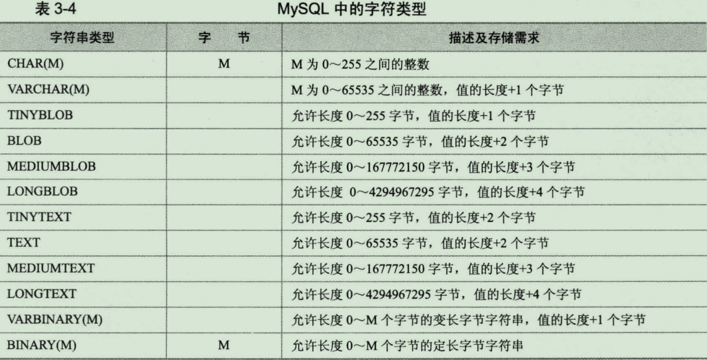
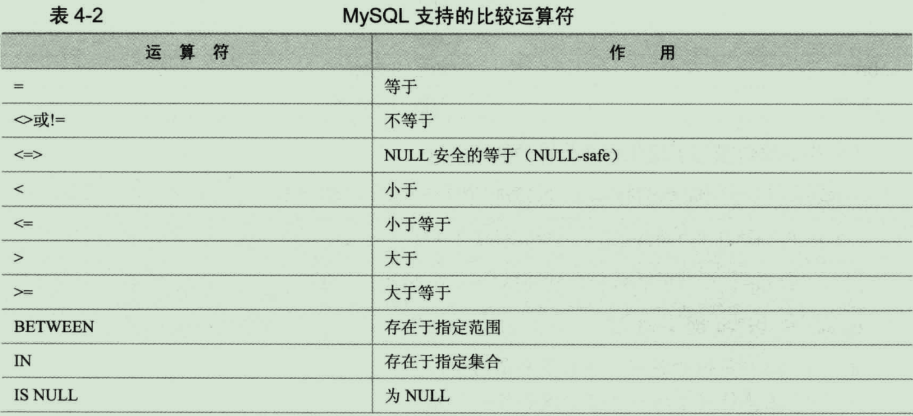
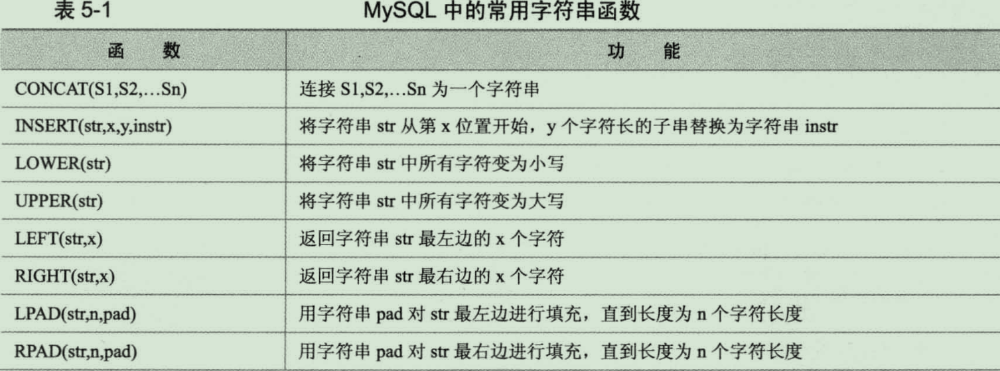
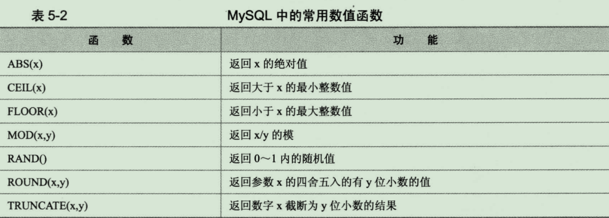
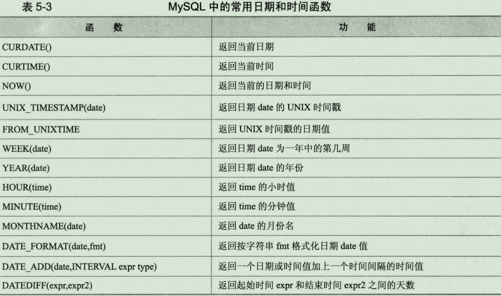

## <div id="class01">第一部分、基础篇</div>

### <div id="class01-01">01章、mysql的安装与配置</div>
这个部分的东西太过于基础，直接看网上搜索的文章就可以了：
[mysql下载与安装问题整理](../../../18年/09月/02、mysql下载与安装问题整理/)


### <div id="class01-02">02章、sql基础</div>
#### sql语句分类
DDL： 数据定义语言 - create、drop、alter等                 
DML： 数据操作语句 - insert、delete、update、select等                
DCL： 数据控制语句 - grant、revoke等

#### DDL语句
**1、创建数据库**               
  
`CREATE DATABASE dbname`              
然后可以输入： `show databases ;`可以查看已经创建的数据库                  

`use dbname`  选择具体的数据库                    
`show tables`  查看所有数据表                  


**2、删除数据库**                 

`drop database dbname` 就可以删除相对应的数据库了                          


**3、创建表**

```Mysql
CREATE TABLE tablename (
    column_name_1 column_type1 constraints,
    column_name_2 column_type2 constraints,
    column_name_3 column_type3 constraints,
    ..............
    column_name_n column_typen constraints,
)
```
column_name是列的名字；column_type是列的数据类型；constraints是列的约束条件            
      
实例： 
```sql
create table if not exists emp(
  ename varchar(10),
  hiredate date,
  sal decimal(10,2),
  deptno int(2)
);
```
`desc emp;`  可以查看表的定义                   
`show create table emp;`  可以查看更加全面的具体sql语句信息    


**4、删除表**

`drop table if exists emp;`                   


**5、修改表**
column_definition 表示一个明确的字段定义 包括名字和属性

**5.1、修改表的类型**              

`alter table tablename MODIFY [COLUMN] column_definition [FIRST|AFTER col_name]`                     
例如 要修改emp表的ename字段的定义，想varchar(10)改为varchar(20);                    
`alter table emp modify ename varchar(20);`

**5.2、添加表字段**               

`alter table tablename ADD [COLUMN] column_definition [FIRST|AFTER col_name]`                   
例如 要给emp表加新字段age, 类型为int(3): `alter table emp add column age int(3);`                                   

**5.3、删除字段**

`alert table tablename DROP [COLUMN] col_name`              
例如我们要删除 age 字段 ： `alter table emp drop column age;`                 

**5.4、修改字段名**

`alter table tablename change [column] old_col_name column_definition [first|after col_name]`            
例如 把emp表的age改名为age1，同事修改字段类型为int(4):  `alter table emp change age age1 int(4);`             

**5.5、修改字段排列顺序**

添加介绍的 add/change/modify 中还有一个可选项 first|after column_name 这个可以修改字段在表的位置；                     
例如 add添加新字段默认在表的最后的位置， 比如添加birth data 在ename 之后： `alter table emp add birth date after ename;`              
例如 修改age，将他放在最近前: `alter table emp modify age int(3) first;`

**5.6、修改表名**

`alter table tablename rename [to] new_tablename`                   
例如 把emp改为emp1: `alter table emp rename emp1;`                       


#### DML语句
**1、插入语句**

`insert into tablename (field1, field2, ......, fieldn) values (value1, value2, ......, valuen);`               
例如 我们向emp中插入一条数据： `insert into emp (ename, hiredate, sal, deptno) values ('yanle', '2018-08-01', '10000', 1);`                                
例如 可以不指定字段名称，但是后面 values 后面的顺序应该和字段是一样的排列： `insert into emp values ('lele', '2018-08-01', '10000', '2');`                             
例如 只对ename和sal字段实现插入值： `insert into emp (ename, sal) values ('dony', 7000);`                                  
例如 查看实际插入的值： `select * from emp;`                   

一次性插入多个数据：              
```sql
insert into tablename (field1, field2, ......, fieldn)
 values 
 (record1_value1, record2_value2, ......, recordn_valuen),
 ..............
 (recordn_value1, recordn_value2, ......, recordn_valuen);
```
例如 对emp表一次性插入两条数据：
```sql
insert into emp (ename, hiredate, sal, deptno)
values
       ('yanle3', '2018-08-01', '10000', 3),
       ('yanle4', '2018-09-15', '1000', 4);
```

**2、更新记录**                  

`update tablename set field1=value1, field2=value2, .... fieldn=valuen [where condition]`                   
例如 把dony的sal 从7000 改为 4000： `update emp set sal=4000 where ename='dony';`

同时更新多个表中的数据：                
`update t1, t2,...... tn set t1.field1=expr1, t2.field2=expr2, ...... tn.fieldn=exprn [where condition]`                    
例如 同时更新emp表中的sal字段和dept表中deptname字段的数据：
```sql
create table if not exists dept(
  deptno int(3),
  deptname varchar(10)
);
insert into dept(deptno, deptname)
VALUES
       (1, 'tech'),
       (2, 'sale'),
       (5, 'fin');
select * from dept;
update emp, dept set emp.sal=emp.sal * dept.deptno, dept.deptname=emp.ename where emp.deptno=dept.deptno;
update emp a, dept b set a.sal=a.sal * b.deptno, b.deptname=a.ename where a.deptno=b.deptno;
```
上面最后两条插入语句执行的效果是一样的。只是最后一句语句添加了一个别名而已。                      

**3、删除记录**

`delete from tablename [where condition]`                   
例如 在emp中， 将ename为'dony'的记录全部删除： `delete from emp where ename='dony';`                   

同时删除多个表的数据（from后面的表要用别名，则delete后面的也要用相应的别名）：         
`delete t1, t2, ...tn from t1, t2,...tn [where condition];`                     
例如 同时删除emp和dept中deptno为3的记录： `delete a,b from emp a, dept b where a.deptno=b.deptno and a.deptno=3;`

**4、查询记录**

`select * from tablename [where condition];`                
例如 把所有记录都查出来： `select * from emp;`              
例如 用逗号分隔想要查询的数据： `select ename,sal,deptno from emp;`                

**4.1、查询不重复的记录：使用关键字`distinct`实现**                  
`select distinct deptno from emp;`

**4.2、多条件查询**
例如 查询所有deptno为2的记录： `select * from emp where deptno=2;`                     

多条件查询中，除了 = 还可以使用，>, <, >=, <=, != 等比较运算符号， 还可以使用and 和 or 等逻辑运算符：
例如 `select * from emp where deptno<=5 and sal>5000;`

**4.3、排序和限制**                   

`select * from tablename [where condition] [order by field1 [desc|asc], field2 [desc|asc], ... fieldn [desc|asc]];`                                          
asc 升序；desc 降序；默认是由低到高的排列； 如果排序字段值一样，则相同的字段按照第二个排列字段进行排序；                   

例如 emp表按照sal由低到高排序： 
```sql
select * from emp order by sal;
select * from emp order by sal asc;
```
例如 emp表按照sal 降序： `select * from emp order by sal desc;`             
例如 对于deptno相同的两条记录，可以按照工资降序排列： `select * from emp order by deptno, sal desc;`    

对于后面的记录，只希望查询一部分，而不是全部，可以用limit关键字来限制：                                    
`select ... [limit offset_start, row_count]`                             
如果offset_start偏移量为0 ，可以省略。                  
例如 查询emp表中对sal 排序后的钱三条： `select * from emp order by sal limit 3;`                   
例如 第二条开始，查询三条： `select * from emp order by sal limit 1,3;`                  


**4.4、聚合操作**

`select [field1, field2,... fieldn] fun_name from tablename [where where_contition] [group by field1, field2, ... fieldn [with rollup]] [having where_contition]`                   
参数说明：               
fun_name 表示要聚合操作， 也是聚合函数， 常用的有sum(求和)、count(*)（记录数）、max、min;                        
group my 表示要进行分类聚合的字段，比如按照部门分类统计员工数量，部门就应该写在group by 后面；                    
WITH ROLLUP 可选语法，表示是否对分类聚合后的结果进行在汇总；                    
HAVING 表示分类后的结果在进行条件的赛选

例如 要统计emp的总人数: `select count(1) from emp;`                  
例如 要在此基础上统计各个部门的人数： `select deptno,count(1) from emp group by deptno;`                  
例如 既要统计各个部门的人数，又要统计总人数： `select deptno,count(1) from emp group by deptno with rollup;`                  
例如 统计人数大于1的部门： `select deptno,count(1) from emp group by deptno having count(1)>1;`                     
例如 最后统计公司所有员工的薪水总额，最高薪水和最低薪水： `select sum(sal),max(sal),min(sal) from emp;`                         

**4.5、表连接**                 
当同事需要显示多个表的字段是，就要用到表连接。表连接分为：内连接和外链接。
区别：内连接仅选出两张表中相互匹配的记录；外链接会选出其他不匹配的记录。常用捏连接                   

例如 要查处所有的雇员名字和所在部门，员工在emp表，部门在dept表中： `select ename,deptname from emp,dept where emp.deptno=dept.deptno;`               

外链接又分为左连接和右连接
左连接： 包含所有左边表中的记录，甚至是右边表中没有和它匹配的记录                   
右连接： 包含所有左边表中的记录，甚至是左边表中没有和它匹配的记录                   
例如 查询emp中所有用户名和所在部门名称： 
```sql
select ename,deptname from emp left join dept on emp.deptno=dept.deptno;
select ename,deptname from dept right join emp on emp.deptno=dept.deptno;
select ename,deptname from dept right join emp on dept.deptno=emp.deptno;
```                  
上面三种查询费结果都是一样的。                 

**4.6、子查询**                     
如果需要的条件是另外一个select语句的结果，就要用到子查询。                    
关键字： `in、not in、=、!=、exists、not exists`等                            

例如 从emp 中查询出所有部门在dept中的所有记录： `select * from emp where deptno in(select deptno from dept);`                                    

如果子查询记录数唯一，可以用 = 代替 in:                     
例如 `select * from emp where deptno =(select deptno from dept);`会报错，以为select deptno from dept 查询出来的deptno不止一个；                                          
例如 `select * from emp where deptno =(select deptno from dept limit 1);` 就不报错了；                  

例如 子查询可以转为表连接查询： 
```sql
select emp.*,dept.* from emp, dept where emp.deptno=dept.deptno;
select emp.* from emp, dept where emp.deptno=dept.deptno;
select dept.* from emp, dept where emp.deptno=dept.deptno;
select ename,deptname from emp, dept where emp.deptno=dept.deptno;
select emp.* from emp, dept where emp.deptno=dept.deptno;
select emp.*, deptname from emp, dept where emp.deptno=dept.deptno;
select emp.*, dept.deptname from emp, dept where emp.deptno=dept.deptno;
```

**4.7、记录联合**                    

将两个表按照一定的查询条件查询出来之后，要把结果联合并到一起现实出来 关键词 **union 和 union all**                        
`select * from t1 union|union all select * from t2 ...... union|union all select * from tn;`

union all 是把结果合并到在一起；                   
union 是将union all后的记过进行了以此distinct,去重处理；            
例如 将emp和dept中部门编号联合起来现实：             
```sql
select deptno from emp union all select deptno from dept;
select deptno from emp union select deptno from dept;
```

#### DCL语句
例如 创建一个yanle数据库用户，对于sakila数据库中所有的表 select/insert 权限：                                   
```sql
grant select, insert on sakila.* to 'yanle'@'localhost' identified by '123456';
```

例如 收回权限
```sql
revoke insert on sakila.* from 'yanle'@'localhost';
revoke select on sakila.* from 'yanle'@'localhost';
```


### <div id="class01-03">03、mysql数据类型</div>
主要包括以下五大类：

整数类型：BIT、BOOL、TINY INT、SMALL INT、MEDIUM INT、 INT、 BIG INT

浮点数类型：FLOAT、DOUBLE、DECIMAL

字符串类型：CHAR、VARCHAR、TINY TEXT、TEXT、MEDIUM TEXT、LONGTEXT、TINY BLOB、BLOB、MEDIUM BLOB、LONG BLOB

日期类型：Date、DateTime、TimeStamp、Time、Year

其他数据类型：BINARY、VARBINARY、ENUM、SET、Geometry、Point、MultiPoint、LineString、MultiLineString、Polygon、GeometryCollection等


#### 数值类型
**1、整型**

|MySQL数据类型|	含义（有符号）|
|:-|:-|
tinyint(m)	|1个字节  范围(-128~127)
smallint(m)	|2个字节  范围(-32768~32767)
mediumint(m)	|3个字节  范围(-8388608~8388607)
int(m)	|4个字节  范围(-2147483648~2147483647)
bigint(m)	|8个字节  范围(+-9.22*10的18次方)


取值范围如果加了unsigned，则最大值翻倍，如tinyint unsigned的取值范围为(0~256)。通常情况是保存非负数或者有较大上限值的时候使用。

对于整型数据，支持后面的小括号内指定现实的宽度。例如int(5) 表示当数值宽度小于5的时候，在数字前面填满宽度。默认快读为11。一般配合serofill使用。
如果插入值大于宽度限制，对插入的数据没有任何影响，还是会按照实际精度进行保存。

整数类型还有一个属性： AUTO_INCREMENT。 在需要产生唯一标识符或者顺序值的时候，就可以用到它。设置了这个属性的值，会从1开始，每行自动增加1。对于任何都想要是用AUTO_INCREMENT属性的列，
应该设置NOT NULL， 并定义为 PRIMARY KEY或者定义为UNIQUE键。
例如 创建一个auto_increment列： 
```sql
create table if not exists AI(
  id int auto_increment not null primary key
);
create table if not exists AI(
  id int auto_increment not null, primary key(id)
);
CREATE TABLE IF NOT EXISTS AI(
  id int auto_increment not null , unique (id)
)
```

**2、浮点型(float和double)**

|MySQL数据类型	|含义|
|:-|:-|
float(m,d)	|单精度浮点型    8位精度(4字节)     m总个数，d小数位
double(m,d)	|双精度浮点型    16位精度(8字节)    m总个数，d小数位


**3、点数类型**
浮点型在数据库中存放的是近似值，而定点类型在数据库中存放的是精确值。 

MySQL数据类型	|含义
|:-|:-|
decimal(m,d)	|参数m<65 是总个数，d<30且 d<m 是小数位。
 
对于浮点型和点数类型来说，（m,d）规则都是一样的。 但是值得注意的是浮点数后面跟(m,d)是非标准用法。不建议这么使用。不指定精度的时候，贵根基实际精度来现实。
decimal不指定精度的时候，会默认整数位为10，小数位为0；


#### 日期时间类型

MySQL数据类型|	含义
|:-|:-|
date	|日期 '2008-12-2'
time	|时间 '12:25:36'
datetime|	日期时间 '2008-12-2 22:06:44'
timestamp|	自动存储记录修改时间
year| 年 范围为1901~2155

可以用now()函数插入当前日期                              

**timestamp**                       
例如：timestamp的问题研究
```sql
create table if not exists t(
  id timestamp
);
insert into t value (null);
select id from t;   # 这个时候可以得到id的一个自动保存的时间

alter table t add id2 timestamp;
show create table t;
```
如果存在第二个timestamp类型。则默认设置为0；可以修改为其他常量日期，但是不能设置为current_timestamp， 以为mysql中timestamp只能有一列默认值为current_timestamp;

timestamp是受时区影响的，其他的类型倒是不会受时区影响                 
查看当前时区 `show varialbes like 'time_zone'`                    
例如我们修改库中的时区： `set tiem_zone='+9:00'`                    
插入某一列记录的时候，如果插入null 或者不明确给出赋值，那么就自动取系统默认值       

例如 创建一个时间自增的表
```sql
create table if not exists test(
  id int(11) auto_increment not null,
  name varchar(100),
  age int(3),
  create_time date,
  update_time timestamp,
  primary key (id)
);
alter table test modify create_time datetime;
desc test;
insert into test(name, age, create_time)
values ('yanle1', 26, now());
select * from test;
update test set name='yanlele' where id=1;
```                    

**datetime**                        
是不严格的语法，允许很多种类型的时间格式，插入时间里面去。


#### 字符串类型


**CHAR 和 VARCHAR类型**                    

char列的长度为创建表时候申明的长度，长度可以为0~255之间任何值;
varchar 接受长度更加长而已；
检索的时候char列删除了尾部的空格，而varchar保留了这些空格。
都是固定长度，指定了字符串长度了之后，就不能超过指定的长度。

例如 创建测试表
```sql
# 创建vc测试库
create table if not exists vc(v varchar(4), c char(4));

# 插入 'ab  '
insert into vc(v,c) values ('ab  ', 'ab  ');

# 现实结果
select length(v),length(c) from vc;

# 加上 + 更加可以看的清楚
select concat(v, '+'),concat(c,'+') from vc;
```

**BINARY和VARBINARY类型**

类似于 CHAR 和 VARCHAR，不同的是他们包含二进制字符串，而不包含非二进制字符串。通常来说，用不上


**ENUM类型**

它值范围需要在创建的时候通过美剧的方式现实指定， 而且每次插入的时候只允许从集合中取单个值，不能取多个值.
而且是忽略大小写的。会自动转为定义的类型。

例如
```sql
create table if not exists test(gender enum('M','F'));
insert into test (gender)
values ('m'),('1'),('f'),(null);
select * from test;
drop table if exists test;
```


**SET类型**

与enum类型，但是不同的地方是，可以一次性选择多个成员。           
例如                  
```sql
create table if not exists test(col set('a','b','c','d'));
insert into test
values ('a,b'),('a,d,a'),('a,b'),('d');
select * from test;
drop table if exists test;
```
值得注意的是重复的成员集合只取一次；


### <div id="class01-04">04、mysql中的运算符</div>

#### 算数运算符
+、-、#、/、%

#### 比较运算符
                     


比较结果为真，返回1， 为假返回0；                  
'BETWEEN' 的使用格式为 `a BETWEEN min and max`; 比较包含上下界相等的情况；                     
'IN' 使用格式为 `a IN (value1, value2, ...)`；                        
'NULL' 使用格式为 `a IS NULL` 或者 `a IS NOT NULL`；                    
**'LIKE''** 使用格式为 `a LIKE %123%`，a中有'123'时，返回1； 例如： `select 123456 like '123%', 123456 like '%123%', 123456 like '%321%';`

#### 逻辑运算符              


#### 位运算符
略。。。。。。。


### <div id="class01-05">05、常用函数</div>
#### 常用字符串函数
                 


**CONCAT(S1,S2,......)**： 包传入的参数连接成为一个字符串                   
字符串与null连接的结果都将是null

**INSERT(str,x,y,instr)**： 字符串str从第X位开始，Y个字符串的子串替换为字符串instr                 
例如 `select insert('beijing2008you', 12, 3, 'me');`

**LOWER(str)和UPPER(str)**: 把字符串转为大写或者小写

**LEFT(str,x)和RIGHT(str,y)**： 分别返回字符串最左边的x字符串和最右边的y个字符；

**LPAD(str,n,pad)和RPAD(str,n,pad)**: 用字符串pad对str最左边和左右边进行填充，直到长度为n个字符长度；

**LTRIM(str)和RTRIM(str)**: 祛除字符串左和右侧的空格；

**REPEAT(str,x)**： 返回str重复X次；                   

**REPLACE(str,a,b)**： 用字符串b替换字符串str出现的字符串a;                 

**TRIM(str)**: 祛除左右两侧空格；

**SUBSTRING(str,x,y)**： 返回字符串str从x位置起，y个字符长度的字符串；

#### 数值函数
             

#### 日期和时间函数



