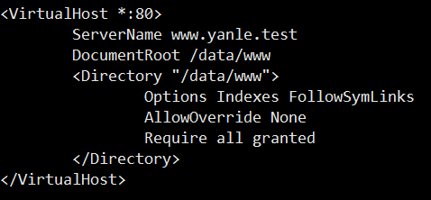

## 应用服务部分

### 
01、Apache的安装

说明 | 命令
:-|:-
安装 | yum install httpd
启动 | service httpd start
停止 | service httpd stop

启动之后可以坚挺进程： `ps -ef | grep httpd`                   
启动之后，就可以拿着公网IP 去访问，默认80端口。                  
可以查看网络状态： `netstat -anpl|grep 'http'`
如果开启服务之后还是无法访问页面，检查防火墙情况，这里可以选择直接关闭防火墙： service firewalld stop

在这个地方有一个很坑的地方，我的轻量云服务器默认是启动了nginx 的, 而且nginx 没有安装环境变量。所以必须要手动去停止nginx. `nginx -s stop`;

### 
02、Apache的虚拟主机和伪静态资源操作

#### 配置虚拟主机
配置虚拟主机的目的是为了一个服务器，可以部署多个网站

首先要进入的目录： /etc/httpd/conf
这个时候我们要修改目录下面的 httpd.conf 文件
全局搜索 virtual 关键字
搜索到了之后，在其后面添加内容：                                            
                        
然后保存退出之后重启服务器;

如果 data/www没有这个目录，我们可以自己新建这个目录，然后在随便扔一个index.html文件就可以了；                    
当然想访问这个域名，首先要配置一个host; 配置好了之后，访问域名，发现还是跟我们ip直接访问的是一模一样的。说明虚拟主机并没有生效。                    
这个时候，学学我们默认配置是怎么配置的了。 之后重启服务器，就可以通过域名或者ip访问了。

命令 | 说明
:-|:-
setenforce 0 | 可能服务器里面会有一些设置。

对于配置多个虚拟主机的话，直接把上面那一段复制粘贴重新配置一个就可以了。

#### 伪静态资源操作
配置伪静态资源操作的目录在于 /etc/httpd/modules/mod_rewrite.so

首先我们要在 httpd.conf 文件中配置加载这个模块， 进入文件之后可以直接搜索 LoadModule 来查找关键字：                  
                    

之后在进行如下的重写路由                    
                    

其他的自己慢慢研究吧。。。。。。

### 
03、nginx基础

#### nginx 基本操作

说明 | 命令
:-|:-
安装 | yum install nginx
启动 | service nginx start
停止 | service nginx stop
重载 | service nginx reload
先杀死进程再重载 | service nginx restart

nginx 的默认配置项目录是： `/etc/nginx/`

#### 配置虚拟主机
主要配置需要在 `conf.d/default.conf` 这个里面配置, 如果没有这个文件，就自己创建一个就OK了
也有一些nginx 的配置就在nginx 根目录下面

