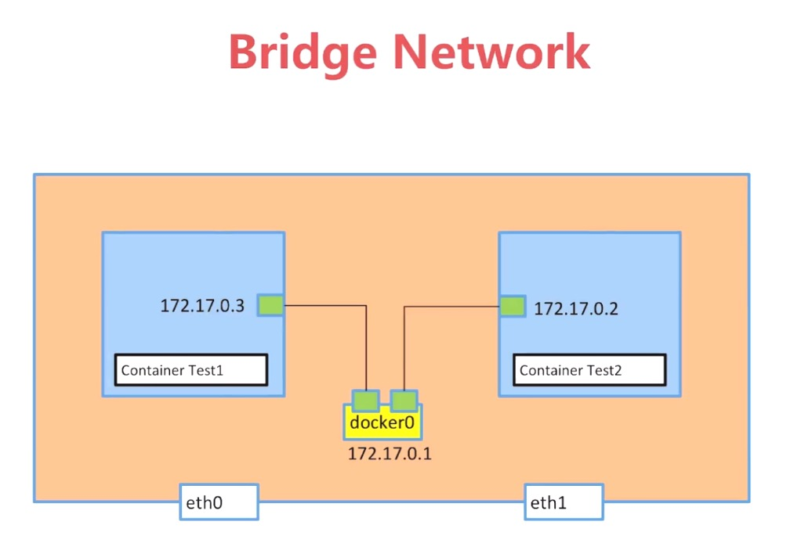
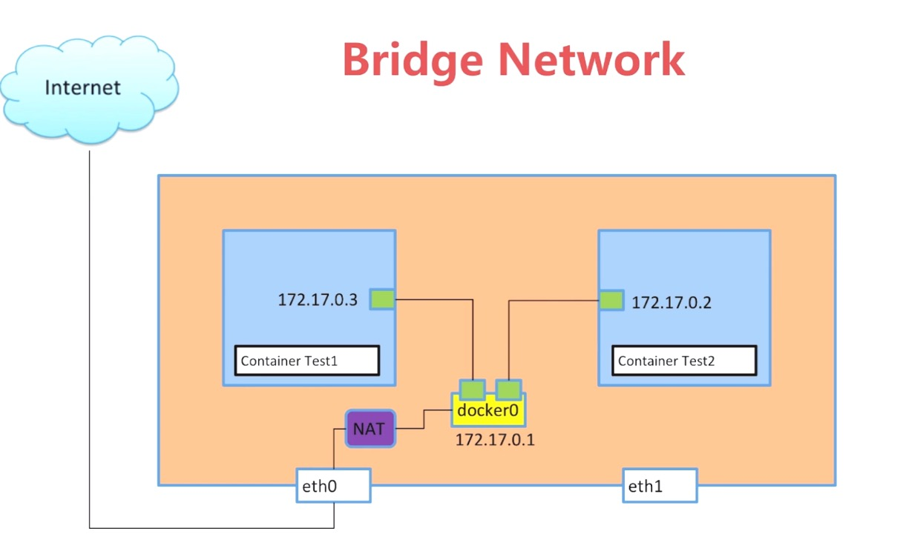

## Docker网络

主要分为 单机网络 和 多机网络


### <div id="class03-01">01、基础网络知识</div>

比如笔记本访问别人的网络， 都是通信包访问的， http协议；                     
略........

路由的概念： 略..........

ip地址和路由：                            
ip 地址是网络唯一标识 略.........

共有IP 和 私有 IP：                       
共有IP 是唯一标识， 可以访问internet                                          
私有IP 不可以在互联网使用， 仅供机构内部使用(例如校园网、公司内网)                            

网络地址转换 NAT:                         
这个可以理解为一个翻译， 比如作为一个校园网， 有一个或者有几个共有IP地址， 
校园内网私有IP 访问外部网络的时候， 先经过 NAT 的转换， NAT 就记住了私有IP和端口， 然后发送请求。                       
返回成功之后， 回到NAT 就查询是哪个私有地址访问的，然后数据包就回到该访问的私有地址。

Ping(ICMP协议) 和 telnet                   
Ping：验证IP的可达性                       
```bash
[vagrant@docker-node1 ~]$ ping www.baidu.com
PING www.a.shifen.com (180.97.33.107) 56(84) bytes of data.
64 bytes from 180.97.33.107 (180.97.33.107): icmp_seq=1 ttl=63 time=44.0 ms
64 bytes from 180.97.33.107 (180.97.33.107): icmp_seq=2 ttl=63 time=91.3 ms
64 bytes from 180.97.33.107 (180.97.33.107): icmp_seq=3 ttl=63 time=38.6 ms
64 bytes from 180.97.33.107 (180.97.33.107): icmp_seq=4 ttl=63 time=43.5 ms
64 bytes from 180.97.33.107 (180.97.33.107): icmp_seq=5 ttl=63 time=55.7 ms
^C
--- www.a.shifen.com ping statistics ---
5 packets transmitted, 5 received, 0% packet loss, time 4011ms
rtt min/avg/max/mdev = 38.671/54.664/91.302/19.155 ms
```

telnet: 验证服务的可用性


### <div id="class03-02">02、网络命名空间</div>
首先拉取一个 `busybox`(非常小的一个linux镜像) 
                 
然后运行它: `sudo docker run -d --name=test1 busybox /bin/sh -c "while true; do sleep 3600; done"` 这个命令就是为了保证这个容器会一直在后台执行
```bash
[vagrant@docker-node1 ~]$ docker container ls
CONTAINER ID        IMAGE               COMMAND                  CREATED             STATUS              PORTS               NAMES
3688c4bbc164        busybox             "/bin/sh -c 'while t…"   17 seconds ago      Up 16 seconds                           test1
```

通过交互式命令 进入到容器里面： `docker exec -it 3688c4bbc164 /bin/sh`                         
在容器里面就可以运行命令了。                      
首先运行 `ip a / ip address`                    
```bash
/ # ip address
1: lo: <LOOPBACK,UP,LOWER_UP> mtu 65536 qdisc noqueue qlen 1000
    link/loopback 00:00:00:00:00:00 brd 00:00:00:00:00:00
    inet 127.0.0.1/8 scope host lo
       valid_lft forever preferred_lft forever
5: eth0@if6: <BROADCAST,MULTICAST,UP,LOWER_UP,M-DOWN> mtu 1500 qdisc noqueue 
    link/ether 02:42:ac:11:00:02 brd ff:ff:ff:ff:ff:ff
    inet 172.17.0.2/16 brd 172.17.255.255 scope global eth0
       valid_lft forever preferred_lft forever
```
上面就是一个网络的 `name space` 网络命名空间                   

在虚拟机本地也可以运行 `ip address` 命令
```bash
[vagrant@docker-node1 ~]$ ip address
1: lo: <LOOPBACK,UP,LOWER_UP> mtu 65536 qdisc noqueue state UNKNOWN group default qlen 1000
    link/loopback 00:00:00:00:00:00 brd 00:00:00:00:00:00
    inet 127.0.0.1/8 scope host lo
       valid_lft forever preferred_lft forever
    inet6 ::1/128 scope host 
       valid_lft forever preferred_lft forever
2: eth0: <BROADCAST,MULTICAST,UP,LOWER_UP> mtu 1500 qdisc pfifo_fast state UP group default qlen 1000
    link/ether 52:54:00:26:10:60 brd ff:ff:ff:ff:ff:ff
    inet 10.0.2.15/24 brd 10.0.2.255 scope global noprefixroute dynamic eth0
       valid_lft 84244sec preferred_lft 84244sec
    inet6 fe80::5054:ff:fe26:1060/64 scope link 
       valid_lft forever preferred_lft forever
3: eth1: <BROADCAST,MULTICAST,UP,LOWER_UP> mtu 1500 qdisc pfifo_fast state UP group default qlen 1000
    link/ether 08:00:27:b3:7d:f8 brd ff:ff:ff:ff:ff:ff
    inet 192.168.205.10/24 brd 192.168.205.255 scope global noprefixroute eth1
       valid_lft forever preferred_lft forever
    inet6 fe80::a00:27ff:feb3:7df8/64 scope link 
       valid_lft forever preferred_lft forever
4: docker0: <BROADCAST,MULTICAST,UP,LOWER_UP> mtu 1500 qdisc noqueue state UP group default 
    link/ether 02:42:ea:c0:4f:9e brd ff:ff:ff:ff:ff:ff
    inet 172.17.0.1/16 brd 172.17.255.255 scope global docker0
       valid_lft forever preferred_lft forever
    inet6 fe80::42:eaff:fec0:4f9e/64 scope link 
       valid_lft forever preferred_lft forever
6: veth656a81d@if5: <BROADCAST,MULTICAST,UP,LOWER_UP> mtu 1500 qdisc noqueue master docker0 state UP group default 
    link/ether fa:eb:9e:97:04:21 brd ff:ff:ff:ff:ff:ff link-netnsid 0
    inet6 fe80::f8eb:9eff:fe97:421/64 scope link 
       valid_lft forever preferred_lft forever
```
上面的也是一个 网络命名空间

两个网络命名空间是不一样的， 而且是完全隔离的。

#### 运行第二个容器
`sudo docker run -d --name=test2 busybox /bin/sh -c "while true; do sleep 3600; done"`              
```bash
[vagrant@docker-node1 ~]$ docker container ls 
CONTAINER ID        IMAGE               COMMAND                  CREATED             STATUS              PORTS               NAMES
04ac9d71cf7b        busybox             "/bin/sh -c 'while t…"   5 seconds ago       Up 5 seconds                            test2
3688c4bbc164        busybox             "/bin/sh -c 'while t…"   2 days ago          Up 28 seconds                           test1
```

如果只是想看某一个容器的网络， 就可以直接运行这样的命名: `sudo docker exec [container id | name] ip address`                 
例如， 查看第一个容器的IP 地址： `sudo docker exec 04ac9d71cf7b ip address`
```bash
[vagrant@docker-node1 ~]$ docker exec test1 ip address
1: lo: <LOOPBACK,UP,LOWER_UP> mtu 65536 qdisc noqueue qlen 1000
    link/loopback 00:00:00:00:00:00 brd 00:00:00:00:00:00
    inet 127.0.0.1/8 scope host lo
       valid_lft forever preferred_lft forever
5: eth0@if6: <BROADCAST,MULTICAST,UP,LOWER_UP,M-DOWN> mtu 1500 qdisc noqueue 
    link/ether 02:42:ac:11:00:02 brd ff:ff:ff:ff:ff:ff
    inet 172.17.0.2/16 brd 172.17.255.255 scope global eth0
       valid_lft forever preferred_lft forever
```
就可以打印出容器的命名空间

查看容器 test2 的命名空空间： `docker exec test2 ip address`
```bash
[vagrant@docker-node1 ~]$ docker exec test2 ip address
1: lo: <LOOPBACK,UP,LOWER_UP> mtu 65536 qdisc noqueue qlen 1000
    link/loopback 00:00:00:00:00:00 brd 00:00:00:00:00:00
    inet 127.0.0.1/8 scope host lo
       valid_lft forever preferred_lft forever
7: eth0@if8: <BROADCAST,MULTICAST,UP,LOWER_UP,M-DOWN> mtu 1500 qdisc noqueue 
    link/ether 02:42:ac:11:00:03 brd ff:ff:ff:ff:ff:ff
    inet 172.17.0.3/16 brd 172.17.255.255 scope global eth0
       valid_lft forever preferred_lft forever
```
可以发现 test1 和 test2 的命名空间的区别。 

同时可以进入 test1 里面， 是能够ping通test2的。 例如交互式进入test1: `[vagrant@docker-node1 ~]$ docker exec -it test1 /bin/sh`                
```bash
/ # ping 127.0.0.3
PING 127.0.0.3 (127.0.0.3): 56 data bytes
64 bytes from 127.0.0.3: seq=0 ttl=64 time=0.077 ms
64 bytes from 127.0.0.3: seq=1 ttl=64 time=0.095 ms
64 bytes from 127.0.0.3: seq=2 ttl=64 time=0.268 ms
64 bytes from 127.0.0.3: seq=3 ttl=64 time=0.243 ms
^
--- 127.0.0.3 ping statistics ---
4 packets transmitted, 4 packets received, 0% packet loss
round-trip min/avg/max = 0.077/0.170/0.268 ms
```

同理， test2 也是可以ping通 test1, 这就说明了， 这两个容器的`net work space`是可以相互通信的。 


#### 创建一个Linux NetWork NameSpace
查看本机的`net work space`: `sudo ip netns list`                       
删除本机的`net work space`: `sudo ip netns delete [nws name]`                   
创建本机的`net work space`: `sudo ip netns add [nws name]`

例如我创建了两个`net work space`, 分比为 test1  和 test2。                   
查看这两个创建好的`net work space`的ip: `sudo ip netns exec test1 ip address`                 
```
[vagrant@docker-node1 ~]$ sudo ip netns exec test1 ip a
1: lo: <LOOPBACK> mtu 65536 qdisc noop state DOWN group default qlen 1000
    link/loopback 00:00:00:00:00:00 brd 00:00:00:00:00:00
```
会发现有一个本地端口， 端口没有地址，没有up 状态。

输入命令行: `ip link ` 可以查看 链接状态
```bash
[vagrant@docker-node1 ~]$ ip link
1: lo: <LOOPBACK,UP,LOWER_UP> mtu 65536 qdisc noqueue state UNKNOWN mode DEFAULT group default qlen 1000
    link/loopback 00:00:00:00:00:00 brd 00:00:00:00:00:00
2: eth0: <BROADCAST,MULTICAST,UP,LOWER_UP> mtu 1500 qdisc pfifo_fast state UP mode DEFAULT group default qlen 1000
    link/ether 52:54:00:26:10:60 brd ff:ff:ff:ff:ff:ff
3: eth1: <BROADCAST,MULTICAST,UP,LOWER_UP> mtu 1500 qdisc pfifo_fast state UP mode DEFAULT group default qlen 1000
    link/ether 08:00:27:b3:7d:f8 brd ff:ff:ff:ff:ff:ff
4: docker0: <BROADCAST,MULTICAST,UP,LOWER_UP> mtu 1500 qdisc noqueue state UP mode DEFAULT group default 
    link/ether 02:42:5e:b4:8e:8d brd ff:ff:ff:ff:ff:ff
6: vethdb34b3d@if5: <BROADCAST,MULTICAST,UP,LOWER_UP> mtu 1500 qdisc noqueue master docker0 state UP mode DEFAULT group default 
    link/ether ea:07:f0:af:67:25 brd ff:ff:ff:ff:ff:ff link-netnsid 0
8: veth9d224da@if7: <BROADCAST,MULTICAST,UP,LOWER_UP> mtu 1500 qdisc noqueue master docker0 state UP mode DEFAULT group default 
    link/ether 46:18:24:54:94:9e brd ff:ff:ff:ff:ff:ff link-netnsid 1
```

查看test1 的ip link 状态： `sudo ip netns exec test1 ip link`
```bash
1: lo: <LOOPBACK> mtu 65536 qdisc noop state DOWN mode DEFAULT group default qlen 1000
    link/loopback 00:00:00:00:00:00 brd 00:00:00:00:00:00
```

如何让 test1 的ip 状态 up 起来: `sudo ip netns exec test1 ip link set dev lo up`                    
然后查看link状态
```bash
[vagrant@docker-node1 ~]$ sudo ip netns exec test1 ip link
1: lo: <LOOPBACK,UP,LOWER_UP> mtu 65536 qdisc noqueue state UNKNOWN mode DEFAULT group default qlen 1000
    link/loopback 00:00:00:00:00:00 brd 00:00:00:00:00:00
```

发现一个问题， 这个ip 的状态是一个 `UNKNOWN` ， 而且本机的local 端口也是一个 `UNKNOWN` 状态。
出现这个情况的原因实际上是以为， ip link 是需要链接起来， 两个 `NetWork NameSpace` 链接起来之后， 才能是up 状态。 单个端口是没有办法up的。 

#### 创建一对链接
通过 `ip link` 可以查看本机link
添加一对link: `sudo ip link add veth-test1 type veth peer name veth-test2`
```bash
[vagrant@docker-node1 ~]$ sudo ip link add veth-test1 type veth peer name veth-test2
[vagrant@docker-node1 ~]$ ip link
1: lo: <LOOPBACK,UP,LOWER_UP> mtu 65536 qdisc noqueue state UNKNOWN mode DEFAULT group default qlen 1000
    link/loopback 00:00:00:00:00:00 brd 00:00:00:00:00:00
2: eth0: <BROADCAST,MULTICAST,UP,LOWER_UP> mtu 1500 qdisc pfifo_fast state UP mode DEFAULT group default qlen 1000
    link/ether 52:54:00:26:10:60 brd ff:ff:ff:ff:ff:ff
3: eth1: <BROADCAST,MULTICAST,UP,LOWER_UP> mtu 1500 qdisc pfifo_fast state UP mode DEFAULT group default qlen 1000
    link/ether 08:00:27:b3:7d:f8 brd ff:ff:ff:ff:ff:ff
4: docker0: <NO-CARRIER,BROADCAST,MULTICAST,UP> mtu 1500 qdisc noqueue state DOWN mode DEFAULT group default 
    link/ether 02:42:40:85:19:da brd ff:ff:ff:ff:ff:ff
5: veth-test2@veth-test1: <BROADCAST,MULTICAST,M-DOWN> mtu 1500 qdisc noop state DOWN mode DEFAULT group default qlen 1000
    link/ether 92:b2:ab:20:ed:43 brd ff:ff:ff:ff:ff:ff
6: veth-test1@veth-test2: <BROADCAST,MULTICAST,M-DOWN> mtu 1500 qdisc noop state DOWN mode DEFAULT group default qlen 1000
    link/ether b2:28:fa:22:69:34 brd ff:ff:ff:ff:ff:ff
```

最后一对链接就是新添加的， 没有ip 状态也是down 的。

把 `veth-test1` 添加到 test1 里面去： `sudo ip link set veth-test1 netns test1`                     
```bash
[vagrant@docker-node1 ~]$ sudo ip netns exec test1 ip link
1: lo: <LOOPBACK> mtu 65536 qdisc noop state DOWN mode DEFAULT group default qlen 1000
    link/loopback 00:00:00:00:00:00 brd 00:00:00:00:00:00
6: veth-test1@if5: <BROADCAST,MULTICAST> mtu 1500 qdisc noop state DOWN mode DEFAULT group default qlen 1000
    link/ether b2:28:fa:22:69:34 brd ff:ff:ff:ff:ff:ff link-netnsid 0
```
执行之后， 发现， 这一条link 添加到 test1 里面去了， 然后本地的 这一条link 不见了。

同理 `sudo ip link set veth-test2 natns test2`                                
然后会发现本地， 原来的第五条link 也不见了， 这一天link 被添加到test2 里面去了。                       
```bash
[vagrant@docker-node1 ~]$ sudo ip netns exec test2 ip link
1: lo: <LOOPBACK> mtu 65536 qdisc noop state DOWN mode DEFAULT group default qlen 1000
    link/loopback 00:00:00:00:00:00 brd 00:00:00:00:00:00
5: veth-test2@if6: <BROADCAST,MULTICAST> mtu 1500 qdisc noop state DOWN mode DEFAULT group default qlen 1000
    link/ether 92:b2:ab:20:ed:43 brd ff:ff:ff:ff:ff:ff link-netnsid 0
```

这样我们就成功的将这一对link 分别添加到了 两个 netns 中。                     
会有连个问题， 这两个link 都是down 的状态， 而且没有IP地址。

分别给两个 `veth-test` 分配地址：
`sudo ip netns  exec test1 ip addr add 192.168.1.1/24 dev veth-test1`                                   
`sudo ip netns  exec test2 ip addr add 192.168.1.2/24 dev veth-test2`                                   

但是添加了之后， 查看ip link 依然没有ip 地址                    
需要先启动这两个link:                       
`sudo ip netns exec test1 ip link set dev veth-test1 up`                       
`sudo ip netns exec test2 ip link set dev veth-test2 up`

启动完成之后， 就可以通过: `sudo ip netns exec test1 ip link` 查看link 状态                     
通过: `sudo ip netns exec test1 ip a`

这样已经有ip 地址了， 也是up 起来了。 这就说明两个netns 已经完全链接起来了。                   
```bash
[vagrant@docker-node1 ~]$ sudo ip netns exec test1 ping 192.168.1.2
PING 192.168.1.2 (192.168.1.2) 56(84) bytes of data.
64 bytes from 192.168.1.2: icmp_seq=1 ttl=64 time=0.062 ms
64 bytes from 192.168.1.2: icmp_seq=2 ttl=64 time=0.065 ms
64 bytes from 192.168.1.2: icmp_seq=3 ttl=64 time=0.064 ms
64 bytes from 192.168.1.2: icmp_seq=4 ttl=64 time=0.066 ms
64 bytes from 192.168.1.2: icmp_seq=5 ttl=64 time=0.065 ms
--- 192.168.1.2 ping statistics ---
5 packets transmitted, 5 received, 0% packet loss, time 4001ms
rtt min/avg/max/mdev = 0.062/0.064/0.066/0.007 ms
```

同理 test2 netns 也可以ping 通 test1


### <div id="class03-03">03、bridge</div>
上一节说的两个`net work space` 虽然是完全隔壁的， 但是是可以相互ping 通的。 

启动一个容器test1: `sudo docker run -d --name=test1 busybox /bin/sh -c "while true; do sleep 3600; done"`
查看 docker 的网络： `docker network ls`
```bash
[vagrant@docker-node1 ~]$ docker network ls
NETWORK ID          NAME                DRIVER              SCOPE
dd09816eb1ce        bridge              bridge              local
ad589c9fa968        host                host                local
0dfc9dbf0808        none                null                local
```
其中那个 bridge 就是本机的网络模式

查看docker 网络宿主情况： `sudo docker network inspect [network id]`
```
......
"Containers": {
    "3688c4bbc1644ec80362ed97fc9159d80f32e62135cdd7e79280c6b7f1aee72f": {
        "Name": "test1",
        "EndpointID": "d442b1182e6ca30a8107df5ea3c24595cd87423d95ffc215f28070802b187f21",
        "MacAddress": "02:42:ac:11:00:02",
        "IPv4Address": "172.17.0.2/16",
        "IPv6Address": ""
    }
},
......
```

可以查看本机ip情况
```bash
[vagrant@docker-node1 ~]$ ip a
1: lo: <LOOPBACK,UP,LOWER_UP> mtu 65536 qdisc noqueue state UNKNOWN group default qlen 1000
    link/loopback 00:00:00:00:00:00 brd 00:00:00:00:00:00
    inet 127.0.0.1/8 scope host lo
       valid_lft forever preferred_lft forever
    inet6 ::1/128 scope host 
       valid_lft forever preferred_lft forever
2: eth0: <BROADCAST,MULTICAST,UP,LOWER_UP> mtu 1500 qdisc pfifo_fast state UP group default qlen 1000
    link/ether 52:54:00:26:10:60 brd ff:ff:ff:ff:ff:ff
    inet 10.0.2.15/24 brd 10.0.2.255 scope global noprefixroute dynamic eth0
       valid_lft 82167sec preferred_lft 82167sec
    inet6 fe80::5054:ff:fe26:1060/64 scope link 
       valid_lft forever preferred_lft forever
3: eth1: <BROADCAST,MULTICAST,UP,LOWER_UP> mtu 1500 qdisc pfifo_fast state UP group default qlen 1000
    link/ether 08:00:27:b3:7d:f8 brd ff:ff:ff:ff:ff:ff
    inet 192.168.205.10/24 brd 192.168.205.255 scope global noprefixroute eth1
       valid_lft forever preferred_lft forever
    inet6 fe80::a00:27ff:feb3:7df8/64 scope link 
       valid_lft forever preferred_lft forever
4: docker0: <BROADCAST,MULTICAST,UP,LOWER_UP> mtu 1500 qdisc noqueue state UP group default 
    link/ether 02:42:40:85:19:da brd ff:ff:ff:ff:ff:ff
    inet 172.17.0.1/16 brd 172.17.255.255 scope global docker0
       valid_lft forever preferred_lft forever
    inet6 fe80::42:40ff:fe85:19da/64 scope link 
       valid_lft forever preferred_lft forever
8: vetha622445@if7: <BROADCAST,MULTICAST,UP,LOWER_UP> mtu 1500 qdisc noqueue master docker0 state UP group default 
    link/ether 4e:f1:3d:44:92:5b brd ff:ff:ff:ff:ff:ff link-netnsid 2
    inet6 fe80::4cf1:3dff:fe44:925b/64 scope link 
       valid_lft forever preferred_lft forever
```

其中docker0的 netns 是本机， 那么 `test1 container` 是如何连接 本机的呢， 就是通过 `vetha622445@if7` 连接的。
```bash
[vagrant@docker-node1 ~]$ docker exec test1 ip a
1: lo: <LOOPBACK,UP,LOWER_UP> mtu 65536 qdisc noqueue qlen 1000
    link/loopback 00:00:00:00:00:00 brd 00:00:00:00:00:00
    inet 127.0.0.1/8 scope host lo
       valid_lft forever preferred_lft forever
7: eth0@if8: <BROADCAST,MULTICAST,UP,LOWER_UP,M-DOWN> mtu 1500 qdisc noqueue 
    link/ether 02:42:ac:11:00:02 brd ff:ff:ff:ff:ff:ff
    inet 172.17.0.2/16 brd 172.17.255.255 scope global eth0
       valid_lft forever preferred_lft forever
```
其中 `eth0@if8` 和 本机的 `vetha622445@if7`实际上是一对link. 通过这样的链接， 
就可以链接到主机上面去了， 准确的说是链接到 `docker0`的网络上面去了

链接情况的验证： `brctl`                        
这个工具是需要安装的： `sudo yum install -y bridge-utils`
```bash
[vagrant@docker-node1 ~]$ brctl show
bridge name	bridge id		STP enabled	i
nterfaces
docker0		8000.0242408519da	no		vetha622445
```

如果在创建一个container： `sudo docker run -d --name=test2 busybox /bin/sh -c "while true; do sleep 3600; done"`
```bash
bridge name	bridge id		STP enabled	interfaces
docker0		8000.0242408519da	no		vetha622445
							            vethbe1a1b5
```
就有两个链接了。

两个容器之间的通信：                  
                            

外网链接：                   
                    


